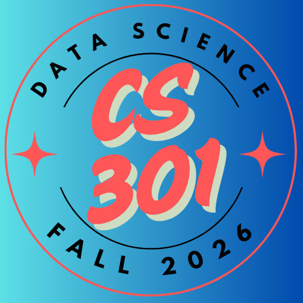

**CMPSC301 :: Data Science :: Fall 2026**

{width=20%}

---

Welcome to the course materials hub! Here you'll find all lecture slides, assignments, labs, and downloadable resources organized by week.

:::{.callout-tip}
## 🔗 Quick Links
- **Project Downloads**: [Starter files, datasets, and tutorials](1_project_files.qmd)
- **JupyterLite Environment**: [Code online with Python & R](/live/)
- **Playground**: [Interactive demonstrations](/playground/00_playground.qmd)
:::

---

## 📥 Course Files & Resources

- **[Project Files & Downloads](1_project_files.qmd)**: All starter code, datasets, tutorials, and project materials

---

## W1. Welcome to Data Science! 🎉

**Week of August 26, 2026**

- **Getting to Know You**: [Welcome Survey](https://forms.gle/placeholder)
- **Icebreaker Activity**: Pair up with classmates and learn:
  - Names and backgrounds
  - Programming experience
  - Favorite data visualization you've seen
  - A dataset you'd love to analyze
  - Career interests in data science
- **Important**: Join our GitHub Organization (check your email!)
- **Discord**: Make sure you're in the course Discord server!

### Materials
- **Lecture 01**: Introduction to Data Science
  - Slides (Coming soon!)
  - What is data science?
  - The data science workflow
  - Tools and technologies
  - Career paths

### Assignments
- **Activity 01**: Setting Up Your Data Science Environment
  - GitHub Classroom Link (Coming soon!)
  - Installing Python, R, Jupyter, VS Code
  - Testing your installation
  - First data exploration

---

## W2. Python Foundations for Data Science 🐍

**Week of September 2, 2026**

*Note: No class Monday, September 7 (Labor Day)*

### Materials
- **Lecture 02**: Python Essentials
  - Slides (Coming soon!)
  - NumPy arrays and operations
  - Pandas DataFrames
  - Data types and structures

- **Lecture 03**: Data Manipulation with Pandas
  - Slides (Coming soon!)
  - Reading CSV, Excel, JSON files
  - Selecting, filtering, sorting data
  - Basic data cleaning

### Assignments
- **Lab 01**: Python Data Structures & Pandas Basics
  - GitHub Classroom Link (Coming soon!)
  - Due: Friday, September 11
  - Working with DataFrames
  - Data selection and filtering
  - Basic calculations

---

## W3. Data Visualization 📊

**Week of September 9, 2026**

### Materials
- **Lecture 04**: Visualization Principles
  - Slides (Coming soon!)
  - Choosing the right chart type
  - Color theory and accessibility
  - Storytelling with data

- **Lecture 05**: Matplotlib, Seaborn & Plotly
  - Slides (Coming soon!)
  - Static plots with Matplotlib
  - Statistical plots with Seaborn
  - Interactive visualizations with Plotly

### Assignments
- **Activity 02**: Creating Your First Visualizations
  - GitHub Classroom Link (Coming soon!)
  - Due: Friday, September 18

- **Lab 02**: Data Visualization Portfolio
  - GitHub Classroom Link (Coming soon!)
  - Due: Friday, September 18
  - Create 5 different chart types
  - Tell a story with data

---

## W4. Statistical Analysis 📈

**Week of September 16, 2026**

### Materials
- **Lecture 06**: Descriptive Statistics
  - Slides (Coming soon!)
  - Measures of central tendency
  - Measures of spread
  - Distributions

- **Lecture 07**: Inferential Statistics
  - Slides (Coming soon!)
  - Hypothesis testing
  - Confidence intervals
  - P-values and significance

### Assignments
- **Lab 03**: Statistical Analysis Project
  - GitHub Classroom Link (Coming soon!)
  - Due: Friday, September 25
  - Analyze a real dataset
  - Test hypotheses
  - Report findings

---

## W5. Data Cleaning & Wrangling 🔧

**Week of September 23, 2026**

### Materials
- **Lecture 08**: Data Quality Issues
  - Slides (Coming soon!)
  - Missing data strategies
  - Outlier detection
  - Data validation

- **Lecture 09**: Advanced Pandas
  - Slides (Coming soon!)
  - Merging and joining
  - Reshaping data
  - Group operations

### Assignments
- **Activity 03**: Cleaning Messy Data
  - GitHub Classroom Link (Coming soon!)
  - Real-world messy dataset
  - Due: Friday, October 2

- **Lab 04**: Data Wrangling Challenge
  - GitHub Classroom Link (Coming soon!)
  - Due: Friday, October 2
  - Multiple data sources
  - Complete cleaning pipeline

---

## W6. Introduction to Machine Learning 🤖

**Week of September 30, 2026**

### Materials
- **Lecture 10**: ML Fundamentals
  - Slides (Coming soon!)
  - Supervised vs unsupervised learning
  - Training and testing
  - Model evaluation

- **Lecture 11**: Regression Models
  - Slides (Coming soon!)
  - Linear regression
  - Multiple regression
  - Model metrics

### Assignments
- **Lab 05**: Building Your First ML Model
  - GitHub Classroom Link (Coming soon!)
  - Due: Friday, October 9
  - Predict continuous values
  - Evaluate model performance

---

## W7. Classification & Model Evaluation 🎯

**Week of October 7, 2026**

### Materials
- **Lecture 12**: Classification Algorithms
  - Slides (Coming soon!)
  - Logistic regression
  - Decision trees
  - Random forests

- **Lecture 13**: Model Evaluation
  - Slides (Coming soon!)
  - Accuracy, precision, recall
  - Confusion matrices
  - ROC curves and AUC

### Assignments
- **Activity 04**: Classification Challenge
  - GitHub Classroom Link (Coming soon!)

- **Lab 06**: Multi-Class Classification
  - GitHub Classroom Link (Coming soon!)
  - Due: Friday, October 16

---

## 🍂 FALL BREAK (October 12-13)

---

## W8. Midterm Project Week 📝

**Week of October 14, 2026**

### Midterm Project
- **Topic**: Comprehensive Data Analysis & Prediction
- **Requirements**:
  - Choose your own dataset
  - Complete EDA with visualizations
  - Build and evaluate a model
  - Written report and presentation
- **Due**: Friday, October 23, 2026
- **Weight**: 20% of final grade

### Support
- Office hours extended this week
- Peer review sessions
- Discord Q&A

---

## W9. Natural Language Processing 💬

**Week of October 21, 2026**

### Materials
- **Lecture 14**: Text Analysis Basics
  - Slides (Coming soon!)
  - Text preprocessing
  - Tokenization and stemming
  - Word frequencies

- **Lecture 15**: Sentiment Analysis
  - Slides (Coming soon!)
  - Sentiment scoring
  - Text classification
  - Applications

### Assignments
- **Lab 07**: Analyzing Text Data
  - GitHub Classroom Link (Coming soon!)
  - Due: Friday, October 30
  - Analyze social media or reviews
  - Build sentiment classifier

---

## W10. Clustering & Unsupervised Learning 🔍

**Week of October 28, 2026**

### Materials
- **Lecture 16**: Clustering Algorithms
  - Slides (Coming soon!)
  - K-means clustering
  - Hierarchical clustering
  - DBSCAN

- **Lecture 17**: Dimensionality Reduction
  - Slides (Coming soon!)
  - PCA (Principal Component Analysis)
  - t-SNE
  - Applications

### Assignments
- **Activity 05**: Customer Segmentation
  - GitHub Classroom Link (Coming soon!)

- **Lab 08**: Unsupervised Learning Project
  - GitHub Classroom Link (Coming soon!)
  - Due: Friday, November 6

---

## W11. Time Series Analysis ⏰

**Week of November 4, 2026**

### Materials
- **Lecture 18**: Time Series Fundamentals
  - Slides (Coming soon!)
  - Trends and seasonality
  - Moving averages
  - Stationarity

- **Lecture 19**: Forecasting
  - Slides (Coming soon!)
  - ARIMA models
  - Prophet
  - Model evaluation

### Assignments
- **Lab 09**: Time Series Forecasting
  - GitHub Classroom Link (Coming soon!)
  - Due: Friday, November 13
  - Predict future values
  - Stock prices or weather data

---

## W12. Databases & Big Data 💾

**Week of November 11, 2026**

### Materials
- **Lecture 20**: SQL for Data Science
  - Slides (Coming soon!)
  - Querying databases
  - Joins and aggregations
  - Subqueries

- **Lecture 21**: Introduction to Big Data
  - Slides (Coming soon!)
  - Distributed computing concepts
  - Introduction to Spark
  - Scalable data processing

### Assignments
- **Activity 06**: SQL Practice
  - GitHub Classroom Link (Coming soon!)

- **Lab 10**: Database Project
  - GitHub Classroom Link (Coming soon!)
  - Due: Friday, November 20

---

## W13. Data Ethics & Communication 🎤

**Week of November 18, 2026**

### Materials
- **Lecture 22**: Ethics in Data Science
  - Slides (Coming soon!)
  - Bias and fairness
  - Privacy and security
  - Responsible AI

- **Lecture 23**: Communicating Results
  - Slides (Coming soon!)
  - Creating effective presentations
  - Data storytelling
  - Dashboards and reports

### Assignments
- **Final Project Proposal Due**: Friday, November 20
  - 1-page description
  - Dataset selection
  - Research questions
  - Methodology outline

---

## 🦃 THANKSGIVING BREAK (November 24-27)

---

## W14. Final Project Work 🚀

**Week of November 25, 2026**

- Final project work time
- Individual consultations
- Peer feedback sessions
- Practice presentations

---

## W15. Final Presentations 🎓

**Week of December 2, 2026**

### Final Project Presentations
- **Tuesday, December 8**: Presentations (Group 1)
- **Thursday, December 10**: Presentations (Group 2)
- **Format**: 10-minute presentation + 5-minute Q&A

### Final Project Deliverables
- **Written Report**: Comprehensive analysis
- **Code Repository**: Clean, documented code
- **Presentation Slides**: Visual summary
- **Interactive Demo** (optional bonus)

**Final Project Due**: Monday, December 15, 2026

---

## 📖 Recommended Resources

### Free Online Books
- [Python for Data Analysis](https://wesmckinney.com/book/) by Wes McKinney
- [R for Data Science](https://r4ds.had.co.nz/) by Hadley Wickham
- [Introduction to Statistical Learning](https://www.statlearning.com/)

### Online Courses
- [Kaggle Learn](https://www.kaggle.com/learn)
- [Google's Machine Learning Crash Course](https://developers.google.com/machine-learning/crash-course)
- [Fast.ai](https://www.fast.ai/)

### Practice Platforms
- [Kaggle Competitions](https://www.kaggle.com/competitions)
- [DataCamp](https://www.datacamp.com/)
- [LeetCode](https://leetcode.com/) (for coding practice)

---

## 🆘 Need Help?

- **Office Hours**: Monday/Wednesday 2-4 PM, Thursday 1-3 PM
- **Discord**: Real-time chat with classmates and instructors
- **GitHub Discussions**: Post questions about assignments
- **Email**: [instructor@allegheny.edu](mailto:instructor@allegheny.edu)

---

*Materials are updated throughout the semester. Check back weekly for new content!*
