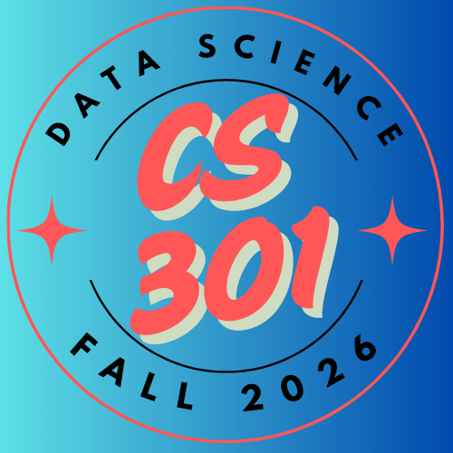

**CMPSC301 :: Data Science**

{width=20%}

---

:::{.callout}
Welcome to the course materials hub! Here you will find all lecture slides, assignments, labs, and downloadable resources organized by week. Check back regularly for updates and new content.
:::

---

- **Project Downloads**: [Starter files, tutorials, and other downloadable project materials](1_project_files.html)

---

## W1. Welcome Week!

- [Syllabus](https://dodatascience.com)
- **Getting to Know You**: [Welcome Survey](https://docs.google.com/forms/d/e/1FAIpQLSejfEH5ZHKSc-wT1UrCDR2kVGEuhVid-eWlyLWH97HKd56Sng/viewform?usp=dialog)
- **Getting to know your neighbor** Pair-up with another person in the class to ask the following interview questions. Write down their answers -- you will be introducing them during next class using several of the below personal facts.

- Get to know your peer by asking the following questions
  - What is your name, and what would you like us to know about you?
  - Where is home?
  - What is your favorite part about life at Allegheny College so far?
  - What experience, if any, do you have with programming, statistics, mathematics, or working with data?
  - What is one thing you hope to learn or be able to do by the end of this course?
  
- Installing necessary software for the course (if anyone needs help!) 
  - [Python](https://www.python.org/)
  - [Visual Studio Code](https://code.visualstudio.com/download) 
  - [GitHub](https://github.com/git-guides/install-git)
  - [Pipx](https://pipx.pypa.io/stable/installation/)
  - [Discord](https://discord.com/download)

- Shared values activity
  - The Department's [Shared Values](https://www.cis.allegheny.edu/teaching/policies/)

<!-- ## W2. Reviewing Python -->
<!-- - Be sure to join the class' GitHub Organization (check your email!) -->
<!-- - Be sure that you are in the Discord channel for the course. If you are not in the Discord channel, please let me know! Also, please use your real names in the channel (otherwise  I will not be able to identify you). -->

<!-- 
### Materials
- **Lecture 01**: Introduction to Data Science
  - Slides (Coming soon!)
  - What is data science?
  - The data science workflow
  - Tools and technologies
  - Career paths

### Assignments
- **Activity 01**: Setting Up Your Data Science Environment
  - GitHub Classroom Link (Coming soon!)
  - Installing Python, R, Jupyter, VS Code
  - Testing your installation
  - First data exploration -->

<!-- - **Activity 01**: Installing Essential Tools and Solving the Maze
  - [GitHub Classroom Link](https://classroom.github.com/a/WIB5VCnJ)
- Installing necessary software for the course (if anyone needs help!) 
  - [Python](https://www.python.org/)
  - [Visual Studio Code](https://code.visualstudio.com/download) 
  - [GitHub](https://github.com/git-guides/install-git)
  - [Pipx](https://pipx.pypa.io/stable/installation/) -->

---

*Materials are updated throughout the semester. Check back weekly for new content!*
