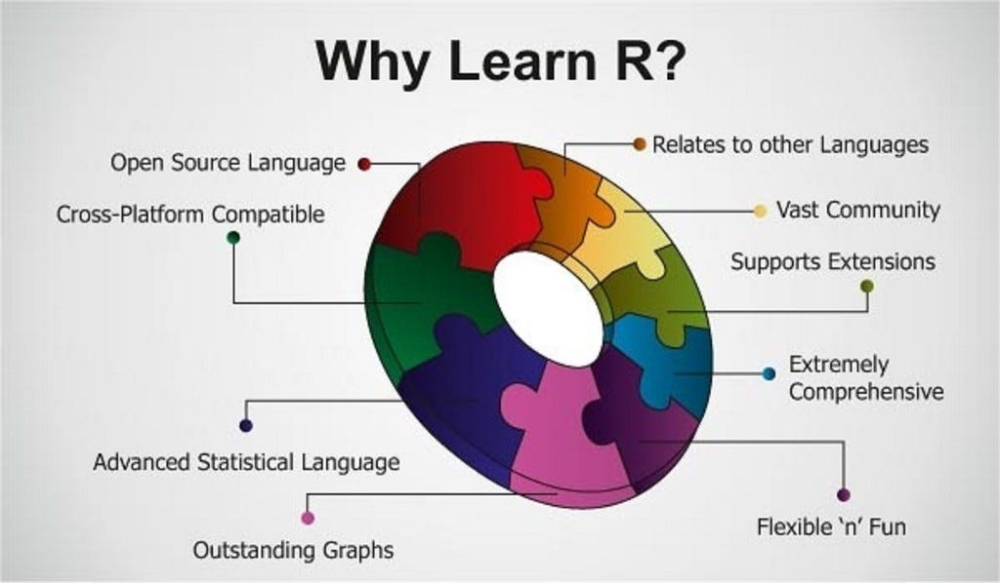
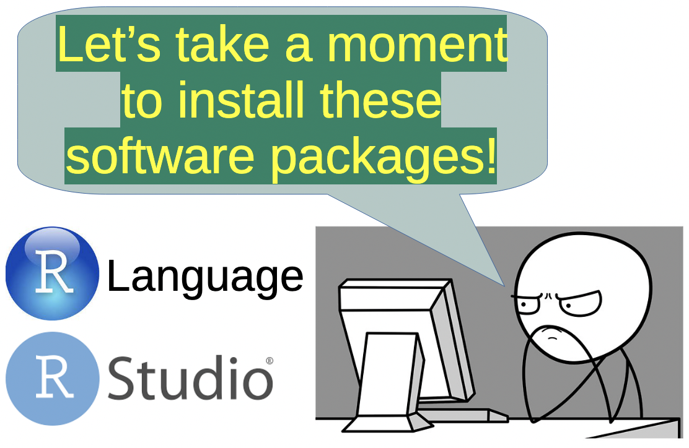
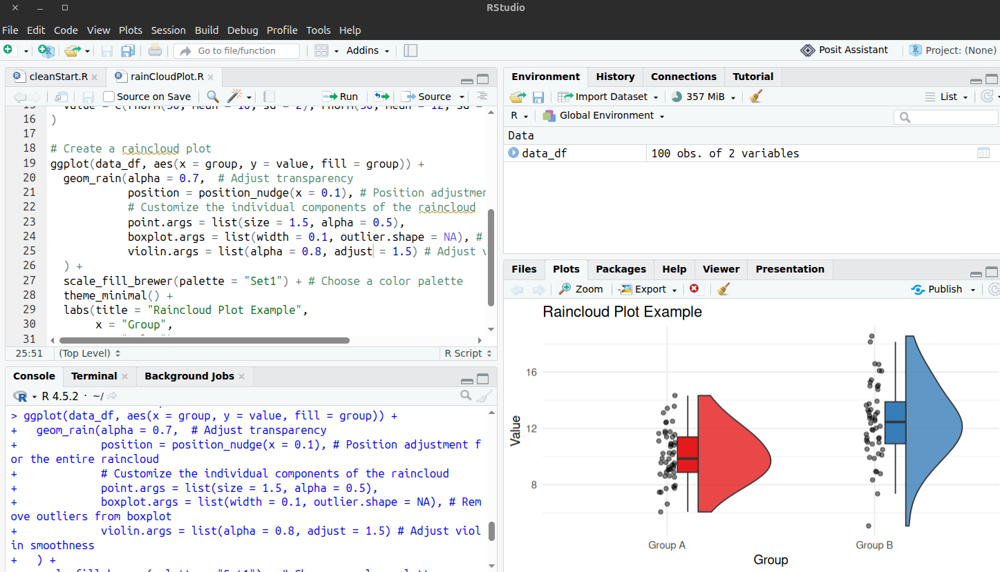

# Welcome to CS301!

::: {.callout-tip icon="true"}
## What You'll Learn Today

* **Course Overview** — What makes this course exciting
* **R & RStudio Setup** — Getting started
* **Variables & Data Types** — Storing information
* **Vectors** — R's fundamental data structure
* **Basic Operations** — Math & logic in R
* **Interactive Tools** — Hands-on code generators!
:::

::: {style="color: #8E44AD; text-align: center; margin-top: 20px;"}
**Get ready for an amazing journey into data science!** 🌟
:::

---

# Careers in Data Science 


<center>
{width=25%}
</center>

::: {.callout icon="false"}

- **Data Analyst**: Works with data to find trends and create reports. They use tools like Excel, SQL, and visualization software.

- **Data Scientist**: Builds models to predict outcomes. They use programming languages like Python or R and machine learning techniques.

- **Data Engineer**: Designs and builds systems to collect and store data. They work with databases and big data tools.

- **Machine Learning Engineer**: Creates algorithms that learn from data. They focus on deploying models in real-world applications.

- **Business Intelligence Analyst**: Translates data into business insights. They create dashboards and help decision-makers.
:::


# Skills for Careers in DS? 

::: {.callout icon="false"}
- **Programming**: Learn Python or R. These languages help you clean and analyze data.

- **Statistics**: Understand basic statistics to interpret data correctly.

- **Data Visualization**: Use tools like Tableau or Power BI to create clear charts.

- **Machine Learning**: Know how to build and test predictive models.

- **Communication**: Explain your findings clearly to non-technical people.

- **Problem Solving**: Think critically to find the best solutions.

:::


::: {.callout-note}

Plan your work, work your plan!
<!-- Ref: [Exploring Career Paths in Data Science](https://www.foundationgenerosity.org/blog/exploring-career-paths-in-data-science) -->

:::

---

# Salaries in Data Science


::: {.callout-important icon="false"}

- Salary by Experience
  - **Level Entry-Level** (0–2 years): $80,000 – $98,000
  - **Mid-Level** (3–5 years): $110,000 – $150,000
  - **Senior / Lead** (5+ years): $160,000 – $220,000+ (including equity and bonuses)

- Top-Paying Cities
  - **San Francisco, CA**: ~$171,870 per year
  - **Seattle, WA**: ~$156,328 per year
  - **New York, NY**: ~$137,426 per year

:::

::: {.callout}

**Salary info:** [USNews](https://www.careercast.com/jobs-directory/data-scientist/salary)

:::

---

# Tentative Course Roadmap
<!-- 🗺️ -->

::: {.callout}

::: {.columns}
::: {.column}
**R Foundations**

* Programming basics
* Data manipulation
* Visualization
* Functions & control flow
* Fun with R!
:::

::: {.column}
**Advanced Topics**

* SQL & databases
* Big data with R
* Shiny applications
* Python integration
* Probability & distributions
:::

::: {.column}
**ML and Beyond**

* Hypothesis testing
* Regression models
* Decision trees
* Neural networks
* Final projects
:::

:::

:::

<!-- ::: {style="text-align: center; margin-top: 15px; background-color: #27AE60; font-weight: bold;"}
Today we start with the fundamentals — the building blocks of everything else!
::: -->

::: {style="text-align: center; margin-top: 15px; color:  #eeff00; background-color: #27AE60; font-weight: bold;"}
Today we start with the fundamentals — the building blocks of everything else!
:::

---

# Part 1: Getting Started with R

---

# Why Data Science with R?

::: {.callout-important icon="false"}
**R: Purpose-Built for Data**

R was designed specifically for statistical computing and data analysis:

* **Statistical Power** — Thousands of built-in functions
* **Visualization Excellence** — Beautiful plots with ggplot2
* **Data Wrangling** — Powerful tidyverse ecosystem
* **Industry Standard** — Used at Google, Facebook, Twitter, academia
* **Career Ready** — High demand for R skills in data science
:::


::: {.callout}

**The Big Picture:** You will learn R for data analysis, but we will also introduce some Python later to show you how they complement each other.

:::

## So, Why Learn this Language? 

::: {.callout icon="false"}

While you are waiting for the install to complete, here's more fun facts about R and why it is a great language to learn for data science!

:::

<center>
{width=70%}
</center>

---

## *R* : The Programming Language (the engine)

<center>
{width=25%}
</center>

::: {.callout icon="false"}


**R** is a programming language for statistical computing and data analysis.

- R was named after its creators: Ross Ihaka and Robert Gentleman, whose names both start with “R.”
- R is especially popular for statistics and data visualization.
- It has thousands of packages that make it useful for everything from analyzing data to creating colorful graphs.
- R can make some seriously impressive graphics. Packages like ggplot2 allow users to create professional-looking charts with just a few lines of code.

:::

---

## *RStudio* : The IDE (the dashboard)

<center>
{width=25%}
</center>

::: {.callout icon="false"}

**RStudio** is an integrated development environment (IDE) for R. It provides a user-friendly interface for writing and executing R code.

- RStudio is an IDE (Integrated Development Environment) designed to make working with R easier. It puts your code, graphs, files, and data tools all in one place.
- RStudio was created by a company originally called RStudio. The company later changed its name to Posit as it expanded its support for other data-science tools.
- RStudio makes packages easier to use. You can install and manage R packages, run code, and view documentation without having to do everything from the command line.
- There is a cloud version called Posit Cloud. It lets you use R and other data-science tools through a web browser without installing everything on your computer.

:::

---

## Installing R & RStudio

::: {.callout icon="false"}
::: {.columns}
::: {.column}
**Download R**

1. Visit <a href="https://cran.r-project.org/" target="_blank">CRAN Download Site</a>
  
1. Click "Download R"
2. Choose your CRAN mirror (if asked, choose one close to your geographical location)
3. Select your OS, download the installer, and follow the installation instructions

Latest version: R 4.5.x: See <a href="https://www.r-project.org/" target="_blank">R Project</a> 

:::

::: {.column}
**Download RStudio**

1. Visit <a href="https://posit.co/downloads" target="_blank">posit.co</a>
2. Download RStudio Desktop (Open Source and Free)
3. Install RStudio after R has been installed
  - Note: RStudio is not the programming language. Instead, it is similar to an IDE that manages R programming.
<!-- 
RStudio gives you:

* Script editor
* Console
* Plots & visualizations
* Environment viewer -->

:::
:::

:::

<center>
{width=50%}
</center>

## Your RStudeo Environment

<center>
{width=100%}
</center>

---

## Your RStudio Environment

::: {.callout icon="false"}
## The Four Panes

**Top-Left:** Script Editor — Write & save your code  
**Bottom-Left:** Console — Execute commands interactively  
**Top-Right:** Environment — See your variables & data  
**Bottom-Right:** Files, Plots, Help, Packages
:::

**Try It Out!** Open RStudio and type in the console:

```r
# Your first R command!
print("Hello, Data Science!")

# Basic math
2 + 2
10 * 5
sqrt(16)
```

<!-- ::: {style="color: #27AE60; font-weight: bold;"}
Pro Tip: The console shows `>` when ready for input. If you see `+`, R is waiting for you to complete a command!
::: -->


::: {style="text-align: center; margin-top: 15px; color:  #eeff00; background-color: #27AE60; font-weight: bold;"}
Pro Tip: The console shows `>` when ready for input. If you see `+`, R is waiting for you to complete a command!
:::


---

# Part 2: Variables & Data Types

---

## Creating Variables

::: {.callout-important icon="false"}
**Variables Store Information**

In R, we use `<-` (or `=`) to assign values to variables
:::

```r
# Creating variables
name <- "Alice"
age <- 25
height_cm <- 170.5
is_student <- TRUE

# Using variables
age + 5              # Result: 30
height_cm / 100      # Convert to meters: 1.705

# You can update variables
age <- age + 1       # Alice had a birthday!
age                  # Now 26
```

::: {.callout-tip}
**Style Guide:** Use `<-` for assignment (not `=`). Use descriptive names with underscores: `student_count`, not `sc` or `studentCount`.
:::

---

## Interactive: Variable Creator

```{=html}
<!-- Global copy to clipboard function -->
<script>
function copyToClipboard(elementId, buttonElement) {
  const element = document.getElementById(elementId);
  const text = element.textContent;
  
  navigator.clipboard.writeText(text).then(function() {
    // Visual feedback
    const originalText = buttonElement.innerHTML;
    buttonElement.innerHTML = '✓ Copied!';
    buttonElement.classList.add('copied');
    
    setTimeout(function() {
      buttonElement.innerHTML = originalText;
      buttonElement.classList.remove('copied');
    }, 2000);
  }).catch(function(err) {
    console.error('Failed to copy:', err);
    buttonElement.innerHTML = '❌ Error';
    setTimeout(function() {
      buttonElement.innerHTML = '📋 Copy';
    }, 2000);
  });
}
</script>

<div class="interactive-tool">
  <h3>🔧 Variable Creator & Tester</h3>
  
  <div class="tool-controls">
    <div class="control-group">
      <label>Variable Name:</label>
      <input type="text" id="var-name" value="my_var" placeholder="e.g., age">
    </div>
    
    <div class="control-group">
      <label>Data Type:</label>
      <select id="var-type">
        <option value="numeric">Numeric</option>
        <option value="character">Character (Text)</option>
        <option value="logical">Logical (TRUE/FALSE)</option>
      </select>
    </div>
    
    <div class="control-group">
      <label>Value:</label>
      <input type="text" id="var-value" placeholder="Enter value">
    </div>
  </div>
  
  <div class="tool-buttons">
    <button class="tool-button" onclick="createVariable()">Create Variable</button>
    <button class="tool-button secondary" onclick="testVariable()">Test Operations</button>
    <button class="tool-button secondary" onclick="clearVarTool()">Clear</button>
  </div>
  
  <div class="tool-output-container">
    <button class="copy-button" onclick="copyToClipboard('var-output', this)">📋 Copy</button>
    <div class="tool-output" id="var-output">Click "Create Variable" to generate R code!</div>
  </div>
</div>

<script>
let currentVar = null;

function createVariable() {
  const name = document.getElementById('var-name').value;
  const type = document.getElementById('var-type').value;
  const value = document.getElementById('var-value').value;
  
  if (!name || !value) {
    document.getElementById('var-output').textContent = "❌ Please enter both name and value!";
    return;
  }
  
  let code = `# Creating a ${type} variable\n`;
  
  if (type === 'character') {
    code += `${name} <- "${value}"\n\n`;
    code += `# Check the type\n`;
    code += `class(${name})     # "character"\n`;
    code += `typeof(${name})    # "character"\n\n`;
    code += `# Examples of operations:\n`;
    code += `nchar(${name})     # Count characters: ${value.length}\n`;
    code += `toupper(${name})   # Uppercase: "${value.toUpperCase()}"\n`;
    code += `tolower(${name})   # Lowercase: "${value.toLowerCase()}"`;
  } else if (type === 'numeric') {
    code += `${name} <- ${value}\n\n`;
    code += `# Check the type\n`;
    code += `class(${name})     # "numeric"\n`;
    code += `typeof(${name})    # "double"\n\n`;
    code += `# Examples of operations:\n`;
    const num = parseFloat(value);
    if (!isNaN(num)) {
      code += `${name} + 10      # Addition: ${num + 10}\n`;
      code += `${name} * 2       # Multiplication: ${num * 2}\n`;
      code += `${name} ^ 2       # Power: ${num * num}\n`;
      code += `sqrt(${name})     # Square root: ${Math.sqrt(num).toFixed(2)}`;
    }
  } else if (type === 'logical') {
    const boolValue = value.toLowerCase() === 'true' ? 'TRUE' : 'FALSE';
    code += `${name} <- ${boolValue}\n\n`;
    code += `# Check the type\n`;
    code += `class(${name})     # "logical"\n`;
    code += `typeof(${name})    # "logical"\n\n`;
    code += `# Examples of operations:\n`;
    code += `!${name}           # NOT: ${boolValue === 'TRUE' ? 'FALSE' : 'TRUE'}\n`;
    code += `${name} & TRUE     # AND: ${boolValue}\n`;
    code += `${name} | FALSE    # OR: ${boolValue}`;
  }
  
  currentVar = { name, type, value };
  document.getElementById('var-output').textContent = code;
}

function testVariable() {
  if (!currentVar) {
    document.getElementById('var-output').textContent = "❌ Create a variable first!";
    return;
  }
  
  const { name, type, value } = currentVar;
  let code = `# Testing ${name}\n\n`;
  
  code += `# Check if variable exists\n`;
  code += `exists("${name}")    # TRUE\n\n`;
  
  code += `# Print the variable\n`;
  code += `print(${name})\n`;
  code += `# Output: ${type === 'character' ? '"' + value + '"' : value}\n\n`;
  
  code += `# Get information\n`;
  code += `str(${name})         # Structure of the variable\n`;
  code += `length(${name})      # Length: 1\n`;
  
  document.getElementById('var-output').textContent = code;
}

function clearVarTool() {
  document.getElementById('var-name').value = 'my_var';
  document.getElementById('var-value').value = '';
  document.getElementById('var-output').textContent = 'Click "Create Variable" to generate R code!';
  currentVar = null;
}
</script>
```

---

## R Data Types: The Big Four

::: {.columns}
::: {.column}
**Numeric** 

```r
# Numbers (integers & decimals)
age <- 25
price <- 19.99
temperature <- -5.2

# Check type
class(age)       # "numeric"
typeof(price)    # "double"
is.numeric(age)  # TRUE
```
:::

::: {.column}
**Character** 

```r
# Text strings (use quotes)
name <- "Alice"
city <- 'Boston'
message <- "Hello, R!"

# Check type
class(name)        # "character"
nchar(name)        # 5 characters
toupper(name)      # "ALICE"
```
:::
:::

::: {.columns}
::: {.column}
**Logical** 

```r
# TRUE or FALSE (Boolean)
is_student <- TRUE
passed_exam <- FALSE
eligible <- TRUE

# Check type
class(is_student)  # "logical"
!is_student        # NOT: FALSE
TRUE & FALSE       # AND: FALSE
TRUE | FALSE       # OR: TRUE
```
:::

::: {.column}
**Special Values** 

```r
# Missing data
missing <- NA      # Not Available

# Infinity
infinity <- Inf
neg_inf <- -Inf

# Not a Number
undefined <- NaN   # 0/0

# NULL (empty)
empty <- NULL
```
:::
:::

---

# Part 3: Vectors - R's Superpower

---

## What are Vectors?

::: {.callout icon="false"}
**Vectors: Collections of Values**

A vector is a sequence of elements of the same type. This is R's most fundamental data structure!
:::

```r
# Creating vectors with c() (combine function)
ages <- c(25, 30, 22, 35, 28)
names <- c("Alice", "Bob", "Carol", "David", "Eve")
passed <- c(TRUE, TRUE, FALSE, TRUE, TRUE)

# Vectors can only hold ONE type
mixed <- c(1, 2, "three", 4)  # Everything becomes character!
class(mixed)  # "character"

# Sequences
nums1 <- 1:10                    # 1 2 3 4 5 6 7 8 9 10
nums2 <- seq(0, 1, by = 0.1)    # 0.0 0.1 0.2 ... 1.0
nums3 <- seq(1, 10, length = 5) # 1.00 3.25 5.50 7.75 10.00

# Repetition
zeros <- rep(0, 5)               # 0 0 0 0 0
pattern <- rep(c(1, 2), 3)       # 1 2 1 2 1 2
```

---

## Vector Operations: The Magic

::: {.callout-tip icon="true"}
## Vectorization: R's Secret Weapon

Operations apply to ALL elements at once — no loops needed!
:::

```r
# Create a vector
prices <- c(10, 20, 30, 40, 50)

# Vectorized operations (work on ALL elements!)
prices * 2           # 20 40 60 80 100
prices + 5           # 15 25 35 45 55
prices / 10          # 1 2 3 4 5
sqrt(prices)         # 3.16 4.47 5.48 6.32 7.07

# Element-wise operations
prices1 <- c(10, 20, 30)
prices2 <- c(5, 10, 15)
prices1 + prices2    # 15 30 45
prices1 * prices2    # 50 200 450

# Statistical functions
mean(prices)         # 30
median(prices)       # 30
sum(prices)          # 150
sd(prices)           # Standard deviation: 15.81
```

---

## Interactive: Vector Operation Builder

```{=html}
<div class="interactive-tool">
  <h3>🎯 Vector Builder & Calculator</h3>
  
  <div class="tool-controls">
    <div class="control-group">
      <label>Vector 1 (comma-separated):</label>
      <input type="text" id="vec1" value="1, 2, 3, 4, 5" placeholder="e.g., 10, 20, 30">
    </div>
    
    <div class="control-group">
      <label>Operation:</label>
      <select id="vec-op">
        <option value="stats">Statistics (mean, sum, etc.)</option>
        <option value="transform">Transform (square, sqrt, log)</option>
        <option value="add">Add Scalar</option>
        <option value="multiply">Multiply Scalar</option>
        <option value="combine">Combine with Vector 2</option>
      </select>
    </div>
    
    <div class="control-group" id="scalar-group">
      <label>Scalar Value:</label>
      <input type="number" id="scalar" value="10">
    </div>
    
    <div class="control-group" id="vec2-group" style="display:none;">
      <label>Vector 2 (comma-separated):</label>
      <input type="text" id="vec2" value="6, 7, 8, 9, 10">
    </div>
  </div>
  
  <div class="tool-buttons">
    <button class="tool-button" onclick="processVector()">Calculate</button>
    <button class="tool-button secondary" onclick="showVectorCode()">Show Full Code</button>
    <button class="tool-button secondary" onclick="clearVectorTool()">Clear</button>
  </div>
  
  <div class="tool-output-container">
    <button class="copy-button" onclick="copyToClipboard('vector-output', this)">📋 Copy</button>
    <div class="tool-output" id="vector-output">Enter vector values and select an operation!</div>
  </div>
</div>

<script>
document.getElementById('vec-op').addEventListener('change', function() {
  const op = this.value;
  document.getElementById('scalar-group').style.display = 
    (op === 'add' || op === 'multiply') ? 'block' : 'none';
  document.getElementById('vec2-group').style.display = 
    (op === 'combine') ? 'block' : 'none';
});

function parseVector(str) {
  return str.split(',').map(x => parseFloat(x.trim())).filter(x => !isNaN(x));
}

function processVector() {
  const vec1Str = document.getElementById('vec1').value;
  const vec1 = parseVector(vec1Str);
  
  if (vec1.length === 0) {
    document.getElementById('vector-output').textContent = "❌ Please enter valid numbers!";
    return;
  }
  
  const operation = document.getElementById('vec-op').value;
  let output = `# Vector: c(${vec1.join(', ')})\n\n`;
  
  if (operation === 'stats') {
    const mean = (vec1.reduce((a, b) => a + b, 0) / vec1.length).toFixed(2);
    const sum = vec1.reduce((a, b) => a + b, 0);
    const min = Math.min(...vec1);
    const max = Math.max(...vec1);
    const sorted = [...vec1].sort((a, b) => a - b);
    const median = sorted.length % 2 === 0 
      ? ((sorted[sorted.length/2 - 1] + sorted[sorted.length/2]) / 2).toFixed(2)
      : sorted[Math.floor(sorted.length/2)];
    
    output += `# Statistical Summary\n`;
    output += `mean(my_vector)     # ${mean}\n`;
    output += `median(my_vector)   # ${median}\n`;
    output += `sum(my_vector)      # ${sum}\n`;
    output += `min(my_vector)      # ${min}\n`;
    output += `max(my_vector)      # ${max}\n`;
    output += `length(my_vector)   # ${vec1.length}\n`;
    output += `range(my_vector)    # ${min} to ${max}`;
    
  } else if (operation === 'transform') {
    const squared = vec1.map(x => (x*x).toFixed(2));
    const sqrted = vec1.map(x => Math.sqrt(x).toFixed(2));
    const doubled = vec1.map(x => x * 2);
    
    output += `# Transformations\n`;
    output += `my_vector ^ 2       # c(${squared.join(', ')})\n`;
    output += `sqrt(my_vector)     # c(${sqrted.join(', ')})\n`;
    output += `my_vector * 2       # c(${doubled.join(', ')})\n`;
    output += `log(my_vector)      # Natural log (try it out!)\n`;
    output += `abs(my_vector)      # Absolute value`;
    
  } else if (operation === 'add') {
    const scalar = parseFloat(document.getElementById('scalar').value);
    const result = vec1.map(x => x + scalar);
    output += `# Adding ${scalar} to each element\n`;
    output += `my_vector + ${scalar}\n`;
    output += `# Result: c(${result.join(', ')})`;
    
  } else if (operation === 'multiply') {
    const scalar = parseFloat(document.getElementById('scalar').value);
    const result = vec1.map(x => x * scalar);
    output += `# Multiplying each element by ${scalar}\n`;
    output += `my_vector * ${scalar}\n`;
    output += `# Result: c(${result.join(', ')})`;
    
  } else if (operation === 'combine') {
    const vec2Str = document.getElementById('vec2').value;
    const vec2 = parseVector(vec2Str);
    
    if (vec2.length === 0) {
      document.getElementById('vector-output').textContent = "❌ Please enter valid numbers for Vector 2!";
      return;
    }
    
    const maxLen = Math.max(vec1.length, vec2.length);
    const summed = [];
    const multiplied = [];
    
    for (let i = 0; i < maxLen; i++) {
      const v1 = vec1[i % vec1.length];
      const v2 = vec2[i % vec2.length];
      summed.push((v1 + v2).toFixed(2));
      multiplied.push((v1 * v2).toFixed(2));
    }
    
    output += `# Vector 2: c(${vec2.join(', ')})\n\n`;
    output += `# Element-wise addition\n`;
    output += `vec1 + vec2         # c(${summed.join(', ')})\n\n`;
    output += `# Element-wise multiplication\n`;
    output += `vec1 * vec2         # c(${multiplied.join(', ')})`;
  }
  
  document.getElementById('vector-output').textContent = output;
}

function showVectorCode() {
  const vec1Str = document.getElementById('vec1').value;
  const vec1 = parseVector(vec1Str);
  
  if (vec1.length === 0) {
    document.getElementById('vector-output').textContent = "❌ Please enter valid numbers!";
    return;
  }
  
  let code = `# Complete Vector Operations Guide\n\n`;
  code += `# Create the vector\n`;
  code += `my_vector <- c(${vec1.join(', ')})\n\n`;
  code += `# Accessing elements\n`;
  code += `my_vector[1]        # First element: ${vec1[0]}\n`;
  code += `my_vector[c(1,3)]   # Elements 1 and 3\n`;
  code += `my_vector[-1]       # All except first\n\n`;
  code += `# Logical indexing\n`;
  code += `my_vector > ${Math.floor(vec1[Math.floor(vec1.length/2)])}\n`;
  code += `my_vector[my_vector > ${Math.floor(vec1[Math.floor(vec1.length/2)])}]\n\n`;
  code += `# Modifying vectors\n`;
  code += `my_vector[1] <- 99  # Change first element\n`;
  code += `my_vector <- c(my_vector, 100)  # Add element\n\n`;
  code += `# Useful functions\n`;
  code += `sort(my_vector)     # Sort ascending\n`;
  code += `rev(my_vector)      # Reverse order\n`;
  code += `unique(my_vector)   # Remove duplicates\n`;
  code += `which(my_vector > 3) # Indices where TRUE`;
  
  document.getElementById('vector-output').textContent = code;
}

function clearVectorTool() {
  document.getElementById('vec1').value = '1, 2, 3, 4, 5';
  document.getElementById('vec2').value = '6, 7, 8, 9, 10';
  document.getElementById('scalar').value = '10';
  document.getElementById('vec-op').selectedIndex = 0;
  document.getElementById('vector-output').textContent = 'Enter vector values and select an operation!';
  document.getElementById('scalar-group').style.display = 'none';
  document.getElementById('vec2-group').style.display = 'none';
}
</script>
```

---

## Accessing Vector Elements

::: {.callout-note icon="false"}
## Indexing: Getting Specific Elements

R uses **1-based indexing** (unlike Python's 0-based)
:::

::: {.columns}
::: {.column}
**Positive Indexing**

```r
fruits <- c("apple", "banana", 
            "cherry", "date")

# Single element
fruits[1]          # "apple"
fruits[3]          # "cherry"

# Multiple elements
fruits[c(1, 3)]    # "apple" "cherry"
fruits[2:4]        # "banana" to "date"

# By logical vector
fruits[c(T, F, T, F)]
# "apple" "cherry"
```
:::

::: {.column}
**Negative Indexing**

```r
# Exclude elements
fruits[-1]         # All except first
fruits[-c(1, 3)]   # Exclude 1st & 3rd

# Logical conditions
scores <- c(85, 92, 78, 95, 88)

scores > 90        # T T F T F
scores[scores > 90] # 92 95

high_scores <- scores[scores >= 85]
# 85 92 95 88
```
:::
:::

---

# Part 4: Basic Operations

---

## Arithmetic Operations

::: {.columns}
::: {.column}
**Basic Math**

```r
# Standard operations
10 + 5         # Addition: 15
10 - 5         # Subtraction: 5
10 * 5         # Multiplication: 50
10 / 5         # Division: 2
10 ^ 2         # Power: 100
10 %% 3        # Modulo: 1
10 %/% 3       # Integer division: 3

# Order of operations
2 + 3 * 4      # 14 (not 20!)
(2 + 3) * 4    # 20
```
:::

::: {.column}
**Mathematical Functions**

```r
# Common functions
sqrt(16)           # 4
abs(-5)            # 5
round(3.14159, 2)  # 3.14
ceiling(3.2)       # 4
floor(3.9)         # 3
log(10)            # 2.302585
log10(100)         # 2
exp(1)             # 2.718282

# Trigonometry
sin(pi/2)          # 1
cos(0)             # 1
```
:::
:::

---

## Comparison & Logical Operations

::: {.columns}
::: {.column}
**Comparisons**

```r
# Comparison operators
5 == 5         # Equal: TRUE
5 != 3         # Not equal: TRUE
5 > 3          # Greater: TRUE
5 < 3          # Less: FALSE
5 >= 5         # Greater/equal: TRUE
5 <= 4         # Less/equal: FALSE

# With vectors (element-wise!)
x <- c(1, 5, 9)
x > 4          # FALSE TRUE TRUE
x == 5         # FALSE TRUE FALSE
```
:::

::: {.column}
**Logical Operators**

```r
# AND, OR, NOT
TRUE & TRUE    # TRUE
TRUE & FALSE   # FALSE
TRUE | FALSE   # TRUE
!TRUE          # FALSE

# With variables
age <- 25
age >= 18 & age < 65   # TRUE

score <- 85
score >= 90 | score < 60  # FALSE

# Element-wise with vectors
x <- c(1, 5, 9)
x > 3 & x < 8  # FALSE TRUE FALSE
```
:::
:::

---

## Interactive: Expression Evaluator

```{=html}
<div class="interactive-tool">
  <h3>🧮 R Expression Evaluator</h3>
  
  <div class="tool-controls">
    <div class="control-group">
      <label>Expression Type:</label>
      <select id="expr-type">
        <option value="arithmetic">Arithmetic</option>
        <option value="comparison">Comparison</option>
        <option value="logical">Logical</option>
        <option value="vector">Vector Operations</option>
      </select>
    </div>
    
    <div class="control-group" id="expr-templates">
      <label>Try These Examples:</label>
      <select id="expr-template" onchange="loadTemplate()">
        <option value="">-- Select Example --</option>
      </select>
    </div>
  </div>
  
  <div class="control-group" style="margin: 10px 0;">
    <label>Enter Your R Expression:</label>
    <input type="text" id="expr-input" placeholder="e.g., 10 + 5 * 2" style="width: 100%; font-size: 1.1em; padding: 8px;">
  </div>
  
  <div class="tool-buttons">
    <button class="tool-button" onclick="evaluateExpression()">Evaluate</button>
    <button class="tool-button secondary" onclick="explainExpression()">Explain</button>
    <button class="tool-button secondary" onclick="clearExprTool()">Clear</button>
  </div>
  
  <div class="tool-output-container">
    <button class="copy-button" onclick="copyToClipboard('expr-output', this)">📋 Copy</button>
    <div class="tool-output" id="expr-output">Enter an expression and click "Evaluate"!</div>
  </div>
</div>

<script>
const exprTemplates = {
  arithmetic: [
    "2 + 3 * 4",
    "(2 + 3) * 4",
    "10 ^ 2",
    "sqrt(16) + 4",
    "log10(100)",
    "round(3.14159, 2)"
  ],
  comparison: [
    "5 > 3",
    "10 == 10",
    "7 != 8",
    "15 <= 20",
    "(5 + 5) == 10"
  ],
  logical: [
    "TRUE & FALSE",
    "TRUE | FALSE",
    "!TRUE",
    "(5 > 3) & (10 < 20)",
    "(5 == 5) | (3 > 10)"
  ],
  vector: [
    "c(1,2,3) + 10",
    "c(1,2,3) * c(10,20,30)",
    "sum(c(1,2,3,4,5))",
    "mean(c(10,20,30,40))",
    "c(1,5,9) > 4"
  ]
};

document.getElementById('expr-type').addEventListener('change', function() {
  const type = this.value;
  const templateSelect = document.getElementById('expr-template');
  templateSelect.innerHTML = '<option value="">-- Select Example --</option>';
  
  exprTemplates[type].forEach(expr => {
    const option = document.createElement('option');
    option.value = expr;
    option.textContent = expr;
    templateSelect.appendChild(option);
  });
});

// Initialize templates
document.getElementById('expr-type').dispatchEvent(new Event('change'));

function loadTemplate() {
  const template = document.getElementById('expr-template').value;
  if (template) {
    document.getElementById('expr-input').value = template;
  }
}

function evaluateExpression() {
  const expr = document.getElementById('expr-input').value.trim();
  
  if (!expr) {
    document.getElementById('expr-output').textContent = "❌ Please enter an expression!";
    return;
  }
  
  try {
    // Simple evaluation for demonstration
    let result;
    let code = `# R Expression\n${expr}\n\n`;
    
    // Try to evaluate (basic JS evaluation)
    const safeExpr = expr
      .replace(/\^/g, '**')
      .replace(/c\(([\d,\s]+)\)/g, '[$1]');
    
    try {
      result = eval(safeExpr);
      code += `# Result\n`;
      
      if (Array.isArray(result)) {
        code += `[1] ${result.join(' ')}\n\n`;
      } else {
        code += `[1] ${result}\n\n`;
      }
      
      code += `# Type\n`;
      if (typeof result === 'boolean') {
        code += `class(result)  # "logical"`;
      } else if (typeof result === 'number') {
        code += `class(result)  # "numeric"`;
      } else if (Array.isArray(result)) {
        code += `class(result)  # "numeric" vector`;
      }
      
    } catch (e) {
      code += `# This expression needs to be run in R!\n`;
      code += `# Copy it to your R console to see the result.`;
    }
    
    document.getElementById('expr-output').textContent = code;
    
  } catch (error) {
    document.getElementById('expr-output').textContent = 
      `❌ Invalid expression! Try one of the examples or check your syntax.`;
  }
}

function explainExpression() {
  const expr = document.getElementById('expr-input').value.trim();
  
  if (!expr) {
    document.getElementById('expr-output').textContent = "❌ Please enter an expression first!";
    return;
  }
  
  let explanation = `# Understanding: ${expr}\n\n`;
  
  if (expr.includes('+')) {
    explanation += `➕ Addition operator\n`;
  }
  if (expr.includes('-')) {
    explanation += `➖ Subtraction operator\n`;
  }
  if (expr.includes('*')) {
    explanation += `✖️ Multiplication operator\n`;
  }
  if (expr.includes('/')) {
    explanation += `➗ Division operator\n`;
  }
  if (expr.includes('^')) {
    explanation += `🔺 Power/exponentiation operator\n`;
  }
  if (expr.includes('sqrt')) {
    explanation += `√ Square root function\n`;
  }
  if (expr.includes('c(')) {
    explanation += `📊 Vector creation with c()\n`;
  }
  if (expr.includes('>') || expr.includes('<')) {
    explanation += `🔍 Comparison operator (returns logical)\n`;
  }
  if (expr.includes('==')) {
    explanation += `⚖️ Equality test (returns logical)\n`;
  }
  if (expr.includes('&')) {
    explanation += `🔗 Logical AND operator\n`;
  }
  if (expr.includes('|')) {
    explanation += `🔀 Logical OR operator\n`;
  }
  
  explanation += `\n# Order of Operations:\n`;
  explanation += `1. Parentheses ( )\n`;
  explanation += `2. Exponents ^\n`;
  explanation += `3. Multiplication & Division * /\n`;
  explanation += `4. Addition & Subtraction + -\n`;
  explanation += `5. Comparisons > < == !=\n`;
  explanation += `6. Logical & | !`;
  
  document.getElementById('expr-output').textContent = explanation;
}

function clearExprTool() {
  document.getElementById('expr-input').value = '';
  document.getElementById('expr-template').selectedIndex = 0;
  document.getElementById('expr-output').textContent = 'Enter an expression and click "Evaluate"!';
}
</script>
```

---

# Recap & Next Steps

::: {.callout-tip icon="true"}
## What We Learned Today

R & RStudio setup
Variables and data types (numeric, character, logical)
Vectors: creation, operations, indexing
Arithmetic, comparison, and logical operations
Interactive tools for hands-on learning
:::

::: {.callout-important}

## Up Next

**Practice:** Create vectors, try operations, experiment!  
**Install:** Make sure R and RStudio are working  
**Preview:** We'll explore data structures (lists, data frames, matrices)
:::
<!-- 
::: {style="text-align: center; margin-top: 20px;"}
**Questions? Let's discuss!** 💬

**Office Hours:** TBD | **Email:** prof@example.edu
::: -->

---

# Quick Challenges!


<center>
{width=80%}
</center>


# Challenge 1: Output Prediction

```{=html}
<div class="quiz-box">
  <div class="quiz-question">What will this code return?</div>
  <pre style="background: #2c3e50; color: #ecf0f1; padding: 10px; border-radius: 4px; margin: 10px 0;">
x <- c(10, 20, 30, 40, 50)
mean(x[x > 25])</pre>
  
  <div class="quiz-options">
    <div class="quiz-option" onclick="checkAnswer(this, false)">25</div>
    <div class="quiz-option" onclick="checkAnswer(this, false)">30</div>
    <div class="quiz-option" onclick="checkAnswer(this, true)">40</div>
    <div class="quiz-option" onclick="checkAnswer(this, false)">35</div>
  </div>
  
  <div id="quiz1-feedback" style="display: none;"></div>
</div>

<script>
function checkAnswer(element, isCorrect) {
  // Clear previous selections
  document.querySelectorAll('.quiz-option').forEach(opt => {
    opt.classList.remove('correct', 'incorrect');
  });
  
  // Mark this answer
  element.classList.add(isCorrect ? 'correct' : 'incorrect');
  
  // Show feedback
  const feedback = document.getElementById('quiz1-feedback');
  feedback.style.display = 'block';
  feedback.className = 'quiz-feedback ' + (isCorrect ? 'correct' : 'incorrect');
  
  if (isCorrect) {
    feedback.textContent = '✅ Correct! x[x > 25] filters to [30, 40, 50], and mean([30,40,50]) = 40';
  } else {
    feedback.textContent = '❌ Not quite! Remember: x[x > 25] keeps only values > 25, then we calculate the mean of those values.';
  }
}
</script>
```
<center>
{width=20%}
</center>


## Challenge 2: Variable Types

```{=html}
<div class="quiz-box">
  <div class="quiz-question">What will be the type of variable <code>x</code> after running: <code>x <- c(1, 2, "3")</code>?</div>
  
  <div class="quiz-options">
    <div class="quiz-option" onclick="checkChallenge1(this, false)">numeric</div>
    <div class="quiz-option" onclick="checkChallenge1(this, true)">character</div>
    <div class="quiz-option" onclick="checkChallenge1(this, false)">mixed</div>
    <div class="quiz-option" onclick="checkChallenge1(this, false)">logical</div>
  </div>
  
  <div id="challenge1-feedback" style="display: none;"></div>
</div>

<script>
function checkChallenge1(element, isCorrect) {
  document.querySelectorAll('#challenge1-feedback').forEach(f => f.previousElementSibling.querySelectorAll('.quiz-option').forEach(opt => {
    opt.classList.remove('correct', 'incorrect');
  }));
  
  element.classList.add(isCorrect ? 'correct' : 'incorrect');
  
  const feedback = document.getElementById('challenge1-feedback');
  feedback.style.display = 'block';
  feedback.className = 'quiz-feedback ' + (isCorrect ? 'correct' : 'incorrect');
  
  if (isCorrect) {
    feedback.textContent = '✅ Correct! R coerces all elements to character because vectors must contain the same type.';
  } else {
    feedback.textContent = '❌ Not quite! When mixing types, R converts everything to character to maintain consistency.';
  }
}
</script>
```

<center>
{width=20%}
</center>

---

## Challenge 3: Vector Operations

```{=html}
<div class="quiz-box">
  <div class="quiz-question">If <code>x <- c(10, 20, 30)</code> and <code>y <- c(1, 2)</code>, what does <code>x + y</code> produce?</div>
  
  <div class="quiz-options">
    <div class="quiz-option" onclick="checkChallenge2(this, false)">Error: vectors different lengths</div>
    <div class="quiz-option" onclick="checkChallenge2(this, true)">11, 22, 31 (with warning)</div>
    <div class="quiz-option" onclick="checkChallenge2(this, false)">11, 22, 30</div>
    <div class="quiz-option" onclick="checkChallenge2(this, false)">31 (sum of all elements)</div>
  </div>
  
  <div id="challenge2-feedback" style="display: none;"></div>
</div>

<script>
function checkChallenge2(element, isCorrect) {
  document.querySelectorAll('#challenge2-feedback').forEach(f => f.previousElementSibling.querySelectorAll('.quiz-option').forEach(opt => {
    opt.classList.remove('correct', 'incorrect');
  }));
  
  element.classList.add(isCorrect ? 'correct' : 'incorrect');
  
  const feedback = document.getElementById('challenge2-feedback');
  feedback.style.display = 'block';
  feedback.className = 'quiz-feedback ' + (isCorrect ? 'correct' : 'incorrect');
  
  if (isCorrect) {
    feedback.textContent = '✅ Correct! R recycles the shorter vector: y becomes c(1,2,1). Result: c(11, 22, 31).';
  } else {
    feedback.textContent = '❌ Try again! R recycles shorter vectors. y becomes c(1,2,1), then adds element-wise.';
  }
}
</script>
```

<center>
{width=20%}
</center>

---

## Challenge 4: Logical Indexing

```{=html}
<div class="quiz-box">
  <div class="quiz-question">Given <code>scores <- c(85, 92, 78, 95, 88)</code>, which code gets scores above 90?</div>
  
  <div class="quiz-options">
    <div class="quiz-option" onclick="checkChallenge3(this, false)">scores[>90]</div>
    <div class="quiz-option" onclick="checkChallenge3(this, true)">scores[scores > 90]</div>
    <div class="quiz-option" onclick="checkChallenge3(this, false)">scores$>90</div>
    <div class="quiz-option" onclick="checkChallenge3(this, false)">filter(scores > 90)</div>
  </div>
  
  <div id="challenge3-feedback" style="display: none;"></div>
</div>

<script>
function checkChallenge3(element, isCorrect) {
  document.querySelectorAll('#challenge3-feedback').forEach(f => f.previousElementSibling.querySelectorAll('.quiz-option').forEach(opt => {
    opt.classList.remove('correct', 'incorrect');
  }));
  
  element.classList.add(isCorrect ? 'correct' : 'incorrect');
  
  const feedback = document.getElementById('challenge3-feedback');
  feedback.style.display = 'block';
  feedback.className = 'quiz-feedback ' + (isCorrect ? 'correct' : 'incorrect');
  
  if (isCorrect) {
    feedback.textContent = '✅ Correct! Logical indexing: scores > 90 creates a TRUE/FALSE vector, used to subset.';
  } else {
    feedback.textContent = '❌ Not quite! Use logical indexing: scores[scores > 90] creates and applies a logical vector.';
  }
}
</script>
```

<center>
{width=20%}
</center>

---

## Challenge 5: Code Writing

```{=html}
<div class="quiz-box">
  <div class="quiz-question">
    <strong>Write code</strong> to create a vector of even numbers from 2 to 20, then find their mean.
    <button class="tool-button" onclick="showChallenge4Solution()" style="margin-top: 10px;">Show Solution</button>
  </div>
  
  <div id="challenge4-solution" style="display: none; margin-top: 15px;">
    <div class="quiz-feedback correct">
      <strong>Solution:</strong><br>
      <code style="display: block; background: #f5f5f5; padding: 10px; margin-top: 8px; border-radius: 4px;">
# Method 1: Using seq()<br>
evens <- seq(2, 20, by = 2)<br>
mean(evens)<br>
<br>
# Method 2: Using sequence and filtering<br>
evens <- (1:10) * 2<br>
mean(evens)<br>
<br>
# Result: 11
      </code>
    </div>
  </div>
</div>

<script>
function showChallenge4Solution() {
  const solution = document.getElementById('challenge4-solution');
  solution.style.display = 'block';
  event.target.textContent = '✓ Solution Shown';
  event.target.disabled = true;
}
</script>
```

<center>
{width=20%}
</center>

---

# Bonus: Quick Reference Card

::: {.columns}
::: {.column}
**Variable Assignment**
```r
x <- 10        # Assign
x = 10         # Also works
10 -> x        # Rarely used
```

**Vector Creation**
```r
c(1,2,3)       # Combine
1:10           # Sequence
seq(1,10,2)    # Custom seq
rep(5, 3)      # Repeat
```

**Vector Access**
```r
x[1]           # First element
x[c(1,3)]      # Multiple
x[2:4]         # Range
x[-1]          # Exclude
x[x>5]         # Logical
```
:::

::: {.column}
**Arithmetic**
```r
+ - * /        # Basic
^ or **        # Power
%% %/%         # Modulo, int div
sqrt() abs()   # Functions
log() exp()    # Logarithms
```

**Comparisons**
```r
== !=          # Equal, not equal
< > <= >=      # Comparisons
```

**Logical**
```r
& |            # AND, OR
!              # NOT
&&  ||         # Short-circuit
```

**Stats**
```r
mean() median()
sum() prod()
min() max()
sd() var()
```
:::
:::

---

<!-- # Thank you! See you next week! 🚀

::: {style="text-align: center; font-size: 1.2em; color: #27AE60; margin-top: 50px;"}
**Keep practicing with R!**

**Remember:** The best way to learn programming is by doing. Try the interactive tools, experiment with code, and don't be afraid to make mistakes! 💪
::: -->
