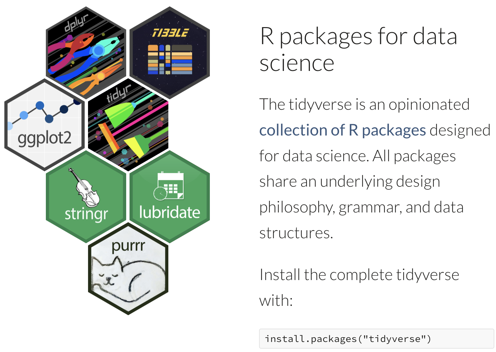
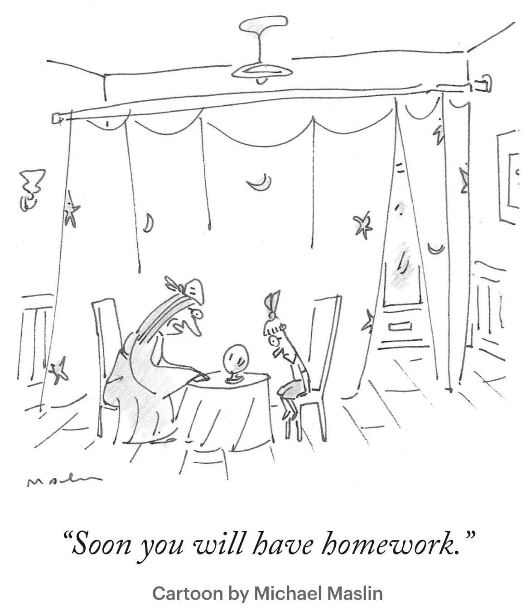
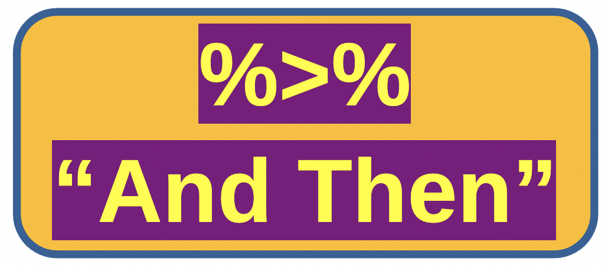
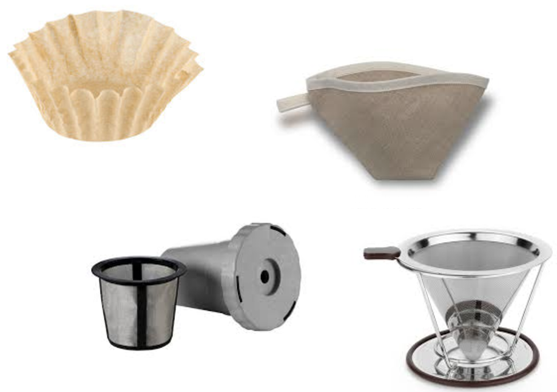
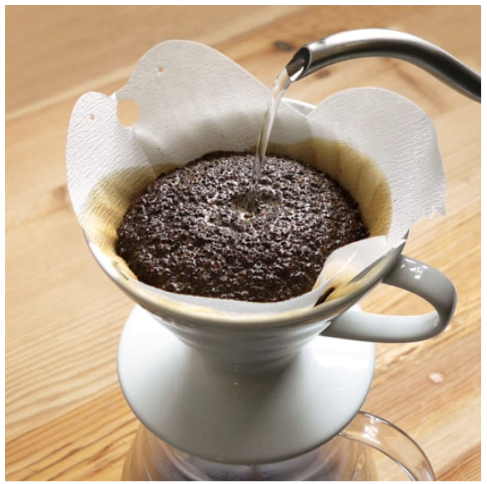

<!-- Add blue text: -->
<!-- ::: {style="color: #2E86C1; font-size: 0.9em; text-align: center; margin-top: 0.5em;"}  -->

<!-- ::: {.callout} -->
<!-- my blue text -->
<!-- ::: -->


# What's on for today?

::: {.callout-tip icon="true"}
## Today's Mission: Data Wrangling

* 📦 **Tidyverse** — The modern R ecosystem
* 🔀 **The Pipe** — %>% operator for readable code
* 🔧 **dplyr Verbs** — select, filter, mutate, arrange, summarize
:::

::: {style="color: #8E44AD; text-align: center; margin-top: 20px;"}
**Transform messy data into insights!** 
:::

---

# The Tidyverse Revolution 

<center>

<a href="https://www.tidyverse.org" target="_blank">
  
</a>
</center>


## What is the Tidyverse?

::: {.callout}
**Tidyverse: R's Modern Data Science Toolkit**

A collection of packages designed to work together seamlessly!
:::

```r
# Install once
install.packages("tidyverse")

# Load in every session
library(tidyverse)

# You get a buncha packages!
# ✅ dplyr    — Data manipulation
# ✅ ggplot2  — Visualization
# ✅ tidyr    — Data tidying
# ✅ readr    — Reading data
# ✅ purrr    — Functional programming
# ✅ tibble   — Modern data frames
# ✅ stringr  — String manipulation
# ✅ forcats  — Factor handling
```

---

# But First This!

<center>

{width=50%}

</center>

# The Pipe Operators: `%>%` and `|>` 


<center>
{width=70%}
</center>

::: {.callout-note icon="false"}
## Make Your Code Read Like a Story!

The pipe `%>%` (and also written as `|>`) passes output from one function to the next.
:::

---

## With and Without Pipes

::: {.columns}
::: {.column}
**Without Pipes**


```r
# Nested (hard to read)
result <- arrange(
            filter(
              select(mtcars, mpg, hp, cyl),
              hp > 100
            ),
            desc(mpg)
          )

# Or many temp variables
temp1 <- select(mtcars, mpg, hp, cyl)
temp2 <- filter(temp1, hp > 100)
result <- arrange(temp2, desc(mpg))
```
:::

::: {.column}
**With Pipes**

```r
# Clean, readable!
result <- mtcars %>%
  select(mpg, hp, cyl) %>%
  filter(hp > 100) %>%
  arrange(desc(mpg))

# Reads like instructions:
# 1. Take mtcars
# 2. Select these columns
# 3. Keep only hp > 100
# 4. Sort by mpg descending
```
:::
:::

::: {.callout}
**Keyboard shortcut:** Cmd/Ctrl + Shift + M = %>%
:::


::: {.callout-tip}
You are not the only person reading your code. Write it *readably* for humans, not just computers!

:::


---

# Looking for a single book in many?

 
<center>
{width=60%}
</center>


::: {style="color: #4b2ec1; font-size: 0.7em; text-align: center; margin-top: 0.5em;"} 

Imagine looking for a single book in a messy bookstore. Do you search by genre, author, or title? How to separate the book from the others? 

::: 

## To find things, we can use filters!


::: {.columns}

::: {.column}

{width=80%}


:::

::: {.column}

{width=75%}


:::

:::


::: {.callout-note}

Data manipulation is a similar challenge: **finding the right information in a messy dataset**.

:::


---

# The dplyr Verbs 1

::: {style="text-align: center; font-size: 1.1em; color: #2E86C1; font-weight: bold;"}
Six powerful functions that solve 90% of data manipulation tasks!
:::

| Verb | Purpose | Example |
|------|---------|---------|
| `select()` | Choose columns | `select(data, name, age)` |
| `filter()` | Choose rows | `filter(data, age > 18)` |
| `mutate()` | Create/modify columns | `mutate(data, age_squared = age^2)` |


# The dplyr Verbs 2

::: {style="text-align: center; font-size: 1.1em; color: #2E86C1; font-weight: bold;"}
Six powerful functions that solve 90% of data manipulation tasks!
:::

| Verb | Purpose | Example |
|------|---------|---------|
| `arrange()` | Sort rows | `arrange(data, desc(age))` |
| `summarize()` | Aggregate data | `summarize(data, mean_age = mean(age))` |
| `group_by()` | Group for operations | `group_by(data, category)` |

---

# 1. select() — Choose Columns

::: {.callout-note icon="false"}
## Pick the columns you need
:::

```r
# Load example data
library(tidyverse)
data(mtcars)

# Select specific columns
mtcars %>% select(mpg, cyl, hp)

# Select range of columns
mtcars %>% select(mpg:hp)

# Select by pattern
mtcars %>% select(starts_with("m"))    # mpg
mtcars %>% select(ends_with("p"))      # hp, disp
mtcars %>% select(contains("ar"))      # gear, carb

# Exclude columns
mtcars %>% select(-wt, -qsec)

# Reorder columns
mtcars %>% select(hp, mpg, everything())

# Rename while selecting
mtcars %>% select(miles_per_gallon = mpg, horsepower = hp)
```

---

# 2. filter() — Choose Rows

::: {.callout-note icon="false"}
## Keep only rows that meet conditions
:::

```r
# Simple filter
mtcars %>% filter(mpg > 20)

# Multiple conditions (AND)
mtcars %>% filter(mpg > 20, cyl == 4)
mtcars %>% filter(mpg > 20 & cyl == 4)

# OR conditions
mtcars %>% filter(cyl == 4 | cyl == 6)
mtcars %>% filter(cyl %in% c(4, 6))

# Complex conditions
mtcars %>% filter(
  mpg > 20,
  cyl %in% c(4, 6),
  hp < 100
)

# Pattern matching
library(datasets)
data(iris)
iris %>% filter(grepl("setosa", Species))

# Missing values
data %>% filter(is.na(column))      # Keep NAs
data %>% filter(!is.na(column))     # Remove NAs
```

---

# 3. mutate() — Create/Modify Columns

::: {.callout-note icon="false"}
## Add or change variables
:::

```r
# Create new column
mtcars %>% 
  mutate(hp_per_cyl = hp / cyl)

# Multiple new columns
mtcars %>%
  mutate(
    kml = mpg * 0.425,           # Convert to km/L
    hp_per_cyl = hp / cyl,
    is_powerful = hp > 150
  )

# Use newly created columns
mtcars %>%
  mutate(
    hp_per_cyl = hp / cyl,
    rating = ifelse(hp_per_cyl > 50, "High", "Low")
  )

# Modify existing column
mtcars %>%
  mutate(mpg = round(mpg, 0))

# Conditional mutation
mtcars %>%
  mutate(
    efficiency = case_when(
      mpg > 25 ~ "High",
      mpg > 20 ~ "Medium",
      TRUE ~ "Low"
    )
  )
```

---

# 4. arrange() — Sort Rows

::: {.callout-note icon="false"}
## Order your data
:::

```r
# Sort ascending (default)
mtcars %>% arrange(mpg)

# Sort descending
mtcars %>% arrange(desc(mpg))

# Multiple columns
mtcars %>% arrange(cyl, desc(mpg))

# Useful with other verbs
mtcars %>%
  filter(hp > 100) %>%
  select(mpg, hp, cyl) %>%
  arrange(desc(mpg))

# Top N
mtcars %>%
  arrange(desc(mpg)) %>%
  head(5)  # Top 5 most efficient

# Bottom N
mtcars %>%
  arrange(mpg) %>%
  head(5)  # 5 least efficient
```

---

# 5. summarize() — Aggregate Data

::: {.callout-note icon="false"}
## Calculate summary statistics
:::

```r
# Single summary
mtcars %>%
  summarize(mean_mpg = mean(mpg))

# Multiple summaries
mtcars %>%
  summarize(
    avg_mpg = mean(mpg),
    sd_mpg = sd(mpg),
    min_mpg = min(mpg),
    max_mpg = max(mpg),
    count = n()
  )

# Useful functions in summarize()
data %>%
  summarize(
    mean = mean(x),
    median = median(x),
    sd = sd(x),
    min = min(x),
    max = max(x),
    sum = sum(x),
    n = n(),                    # Count rows
    n_distinct = n_distinct(x)  # Count unique values
  )
```

---

# 6. group_by() — Group Operations

::: {.callout}
**The Game Changer!** 

`group_by()` + `summarize()` = Super powerful analysis
:::

```r
# Group by cylinder and summarize
mtcars %>%
  group_by(cyl) %>%
  summarize(
    count = n(),
    avg_mpg = mean(mpg),
    avg_hp = mean(hp)
  )
#   cyl count avg_mpg avg_hp
#   4      11    26.7   82.6
#   6       7    19.7  122.3
#   8      14    15.1  209.2

# Multiple grouping variables
mtcars %>%
  group_by(cyl, gear) %>%
  summarize(avg_mpg = mean(mpg))

# Group + mutate (add group stats to each row)
mtcars %>%
  group_by(cyl) %>%
  mutate(
    mean_mpg_by_cyl = mean(mpg),
    diff_from_mean = mpg - mean_mpg_by_cyl
  )
```

---

## Interactive: dplyr Pipeline Builder

```{=html}
<!-- Global copy to clipboard function -->
<script>
function copyToClipboard(elementId, buttonElement) {
  const element = document.getElementById(elementId);
  const text = element.textContent;
  
  navigator.clipboard.writeText(text).then(function() {
    // Visual feedback
    const originalText = buttonElement.innerHTML;
    buttonElement.innerHTML = '✓ Copied!';
    buttonElement.classList.add('copied');
    
    setTimeout(function() {
      buttonElement.innerHTML = originalText;
      buttonElement.classList.remove('copied');
    }, 2000);
  }).catch(function(err) {
    console.error('Failed to copy:', err);
    buttonElement.innerHTML = '❌ Error';
    setTimeout(function() {
      buttonElement.innerHTML = '📋 Copy';
    }, 2000);
  });
}
</script>

<div class="interactive-tool">
  <h3>🔧 Build Your dplyr Pipeline!</h3>
  
  <div class="tool-controls">
    <div class="control-group">
      <label>Dataset:</label>
      <select id="dplyr-data">
        <option value="mtcars">mtcars (cars)</option>
        <option value="iris">iris (flowers)</option>
        <option value="diamonds">diamonds</option>
      </select>
    </div>
  </div>
  
  <div id="pipeline-steps">
    <div class="pipeline-step" style="background: #f8f9fa; padding: 10px; margin: 8px 0; border-radius: 4px; border-left: 4px solid #3498db;">
      <div style="display: flex; gap: 10px; align-items: center;">
        <select class="step-verb" onchange="updateStepInputs(this)" style="padding: 4px; font-size: 0.9em;">
          <option value="select">select()</option>
          <option value="filter">filter()</option>
          <option value="mutate">mutate()</option>
          <option value="arrange">arrange()</option>
          <option value="group_by">group_by()</option>
          <option value="summarize">summarize()</option>
        </select>
        <input type="text" class="step-args" placeholder="arguments" style="flex: 1; padding: 4px; font-size: 0.9em;">
        <button onclick="removeStep(this)" style="padding: 4px 8px; background: #e74c3c; color: white; border: none; border-radius: 4px; cursor: pointer;">✕</button>
      </div>
      <div class="step-hint" style="font-size: 0.75em; color: #666; margin-top: 4px;">
        Example: mpg, cyl, hp
      </div>
    </div>
  </div>
  
  <div class="tool-buttons">
    <button class="tool-button secondary" onclick="addPipelineStep()">➕ Add Step</button>
    <button class="tool-button" onclick="generatePipelineCode()">Generate Code</button>
    <button class="tool-button secondary" onclick="showPipelineExamples()">Examples</button>
    <button class="tool-button secondary" onclick="clearPipelineTool()">Clear</button>
  </div>
  
  <div class="tool-output-container">
    <button class="copy-button" onclick="copyToClipboard('pipeline-output', this)">📋 Copy</button>
    <div class="tool-output" id="pipeline-output">Build your pipeline and click "Generate Code"!</div>
  </div>
</div>

<script>
const stepHints = {
  select: "Column names: mpg, cyl, hp or mpg:hp",
  filter: "Condition: mpg > 20 or cyl == 4",
  mutate: "new_col = expression: kml = mpg * 0.425",
  arrange: "Column names: mpg or desc(mpg)",
  group_by: "Grouping columns: cyl, gear",
  summarize: "name = function(col): avg = mean(mpg)"
};

function updateStepInputs(select) {
  const step = select.closest('.pipeline-step');
  const hint = step.querySelector('.step-hint');
  const verb = select.value;
  hint.textContent = 'Example: ' + stepHints[verb];
}

function addPipelineStep() {
  const container = document.getElementById('pipeline-steps');
  const div = document.createElement('div');
  div.className = 'pipeline-step';
  div.style = 'background: #f8f9fa; padding: 10px; margin: 8px 0; border-radius: 4px; border-left: 4px solid #3498db;';
  div.innerHTML = `
    <div style="display: flex; gap: 10px; align-items: center;">
      <select class="step-verb" onchange="updateStepInputs(this)" style="padding: 4px; font-size: 0.9em;">
        <option value="select">select()</option>
        <option value="filter">filter()</option>
        <option value="mutate">mutate()</option>
        <option value="arrange">arrange()</option>
        <option value="group_by">group_by()</option>
        <option value="summarize">summarize()</option>
      </select>
      <input type="text" class="step-args" placeholder="arguments" style="flex: 1; padding: 4px; font-size: 0.9em;">
      <button onclick="removeStep(this)" style="padding: 4px 8px; background: #e74c3c; color: white; border: none; border-radius: 4px; cursor: pointer;">✕</button>
    </div>
    <div class="step-hint" style="font-size: 0.75em; color: #666; margin-top: 4px;">
      Example: mpg, cyl, hp
    </div>
  `;
  container.appendChild(div);
}

function removeStep(button) {
  const step = button.closest('.pipeline-step');
  if (document.querySelectorAll('.pipeline-step').length > 1) {
    step.remove();
  }
}

function generatePipelineCode() {
  const dataset = document.getElementById('dplyr-data').value;
  const steps = document.querySelectorAll('.pipeline-step');
  
  let code = `library(tidyverse)\n\n`;
  code += `# Load data\n`;
  code += `data(${dataset})\n\n`;
  code += `# Pipeline\n`;
  code += `result <- ${dataset} %>%\n`;
  
  const lines = [];
  steps.forEach((step, idx) => {
    const verb = step.querySelector('.step-verb').value;
    const args = step.querySelector('.step-args').value.trim();
    
    if (args) {
      lines.push(`  ${verb}(${args})`);
    }
  });
  
  if (lines.length === 0) {
    document.getElementById('pipeline-output').textContent = 
      "❌ Add arguments to at least one step!";
    return;
  }
  
  code += lines.join(' %>%\n');
  code += `\n\n# View result\n`;
  code += `result\n`;
  code += `# Or: View(result) in RStudio`;
  
  document.getElementById('pipeline-output').textContent = code;
}

function showPipelineExamples() {
  let code = `# Common dplyr Pipeline Patterns\n\n`;
  
  code += `# Example 1: Filter, select, arrange\n`;
  code += `mtcars %>%\n`;
  code += `  filter(mpg > 20) %>%\n`;
  code += `  select(mpg, cyl, hp) %>%\n`;
  code += `  arrange(desc(mpg))\n\n`;
  
  code += `# Example 2: Create new column, filter on it\n`;
  code += `mtcars %>%\n`;
  code += `  mutate(hp_per_cyl = hp / cyl) %>%\n`;
  code += `  filter(hp_per_cyl > 50) %>%\n`;
  code += `  select(mpg, hp_per_cyl)\n\n`;
  
  code += `# Example 3: Group and summarize\n`;
  code += `mtcars %>%\n`;
  code += `  group_by(cyl) %>%\n`;
  code += `  summarize(\n`;
  code += `    count = n(),\n`;
  code += `    avg_mpg = mean(mpg),\n`;
  code += `    avg_hp = mean(hp)\n`;
  code += `  )\n\n`;
  
  code += `# Example 4: Complex pipeline\n`;
  code += `iris %>%\n`;
  code += `  filter(Sepal.Length > 5) %>%\n`;
  code += `  mutate(Sepal.Area = Sepal.Length * Sepal.Width) %>%\n`;
  code += `  group_by(Species) %>%\n`;
  code += `  summarize(\n`;
  code += `    count = n(),\n`;
  code += `    avg_area = mean(Sepal.Area)\n`;
  code += `  ) %>%\n`;
  code += `  arrange(desc(avg_area))`;
  
  document.getElementById('pipeline-output').textContent = code;
}

function clearPipelineTool() {
  document.getElementById('pipeline-steps').innerHTML = `
    <div class="pipeline-step" style="background: #f8f9fa; padding: 10px; margin: 8px 0; border-radius: 4px; border-left: 4px solid #3498db;">
      <div style="display: flex; gap: 10px; align-items: center;">
        <select class="step-verb" onchange="updateStepInputs(this)" style="padding: 4px; font-size: 0.9em;">
          <option value="select">select()</option>
          <option value="filter">filter()</option>
          <option value="mutate">mutate()</option>
          <option value="arrange">arrange()</option>
          <option value="group_by">group_by()</option>
          <option value="summarize">summarize()</option>
        </select>
        <input type="text" class="step-args" placeholder="arguments" style="flex: 1; padding: 4px; font-size: 0.9em;">
        <button onclick="removeStep(this)" style="padding: 4px 8px; background: #e74c3c; color: white; border: none; border-radius: 4px; cursor: pointer;">✕</button>
      </div>
      <div class="step-hint" style="font-size: 0.75em; color: #666; margin-top: 4px;">
        Example: mpg, cyl, hp
      </div>
    </div>
  `;
  document.getElementById('pipeline-output').textContent = 'Build your pipeline and click "Generate Code"!';
}
</script>
```

---


# Quick Challenges!

<center>
{width=80%}
</center>

## Challenge 1: Pipe Order

```{=html}
<div class="quiz-box">
  <div class="quiz-question">What's the correct order for: "Filter cars with mpg > 20, then select cyl and mpg"?</div>
  
  <div class="quiz-options">
    <div class="quiz-option" onclick="checkPipeChallenge(this, false)">select(cyl, mpg) |> filter(mpg > 20)</div>
    <div class="quiz-option" onclick="checkPipeChallenge(this, true)">filter(mpg > 20) |> select(cyl, mpg)</div>
    <div class="quiz-option" onclick="checkPipeChallenge(this, false)">Both work the same</div>
    <div class="quiz-option" onclick="checkPipeChallenge(this, false)">group_by(mpg) |> filter(mpg > 20)</div>
  </div>
  
  <div id="pipe-challenge-feedback" style="display: none;"></div>
</div>

<script>
function checkPipeChallenge(element, isCorrect) {
  document.querySelectorAll('#pipe-challenge-feedback').forEach(f => f.previousElementSibling.querySelectorAll('.quiz-option').forEach(opt => {
    opt.classList.remove('correct', 'incorrect');
  }));
  
  element.classList.add(isCorrect ? 'correct' : 'incorrect');
  
  const feedback = document.getElementById('pipe-challenge-feedback');
  feedback.style.display = 'block';
  feedback.className = 'quiz-feedback ' + (isCorrect ? 'correct' : 'incorrect');
  
  if (isCorrect) {
    feedback.textContent = '✅ Correct! Filter first to reduce data, then select columns. More efficient!';
  } else {
    feedback.textContent = '❌ Try again! Generally filter() first (reduce rows), then select() (reduce columns).';
  }
}
</script>
```

<center>
{width=20%}
</center>

---

## Challenge 2: Mutate vs Summarize

```{=html}
<div class="quiz-box">
  <div class="quiz-question">Which creates a NEW column while keeping all rows?</div>
  
  <div class="quiz-options">
    <div class="quiz-option" onclick="checkMutateChallenge(this, true)">mutate()</div>
    <div class="quiz-option" onclick="checkMutateChallenge(this, false)">summarize()</div>
    <div class="quiz-option" onclick="checkMutateChallenge(this, false)">filter()</div>
    <div class="quiz-option" onclick="checkMutateChallenge(this, false)">arrange()</div>
  </div>
  
  <div id="mutate-challenge-feedback" style="display: none;"></div>
</div>

<script>
function checkMutateChallenge(element, isCorrect) {
  document.querySelectorAll('#mutate-challenge-feedback').forEach(f => f.previousElementSibling.querySelectorAll('.quiz-option').forEach(opt => {
    opt.classList.remove('correct', 'incorrect');
  }));
  
  element.classList.add(isCorrect ? 'correct' : 'incorrect');
  
  const feedback = document.getElementById('mutate-challenge-feedback');
  feedback.style.display = 'block';
  feedback.className = 'quiz-feedback ' + (isCorrect ? 'correct' : 'incorrect');
  
  if (isCorrect) {
    feedback.textContent = '✅ Correct! mutate() adds columns without changing row count. summarize() collapses to summary stats.';
  } else {
    feedback.textContent = '❌ Not quite! mutate() keeps all rows and adds columns. summarize() reduces to aggregates.';
  }
}
</script>
```

<center>
{width=20%}
</center>

---

## Challenge 3: Filter Conditions

```{=html}
<div class="quiz-box">
  <div class="quiz-question">Which command keeps cars with 6 or 8 cylinders?</div>

  <div class="quiz-options">
    <div class="quiz-option" onclick="checkFilterChallenge(this, false)">filter(cyl == 6 &amp; cyl == 8)</div>
    <div class="quiz-option" onclick="checkFilterChallenge(this, true)">filter(cyl == 6 | cyl == 8)</div>
    <div class="quiz-option" onclick="checkFilterChallenge(this, false)">select(cyl == 6 | cyl == 8)</div>
    <div class="quiz-option" onclick="checkFilterChallenge(this, false)">arrange(cyl == 6 | cyl == 8)</div>
  </div>

  <div id="filter-challenge-feedback" style="display: none;"></div>
</div>

<script>
function checkFilterChallenge(element, isCorrect) {
  document.querySelectorAll('#filter-challenge-feedback').forEach(f => f.previousElementSibling.querySelectorAll('.quiz-option').forEach(opt => {
    opt.classList.remove('correct', 'incorrect');
  }));

  element.classList.add(isCorrect ? 'correct' : 'incorrect');
  const feedback = document.getElementById('filter-challenge-feedback');
  feedback.style.display = 'block';
  feedback.className = 'quiz-feedback ' + (isCorrect ? 'correct' : 'incorrect');
  feedback.textContent = isCorrect
    ? '✅ Correct! Use | for OR when either condition should be kept.'
    : '❌ Try again! A car cannot have both 6 and 8 cylinders, so use | for OR.';
}
</script>
```

<center>
{width=20%}
</center>

---

## Challenge 4: Sorting Rows

```{=html}
<div class="quiz-box">
  <div class="quiz-question">Which pipeline puts the most powerful cars first?</div>

  <div class="quiz-options">
    <div class="quiz-option" onclick="checkArrangeChallenge(this, false)">mtcars |&gt; arrange(hp)</div>
    <div class="quiz-option" onclick="checkArrangeChallenge(this, true)">mtcars |&gt; arrange(desc(hp))</div>
    <div class="quiz-option" onclick="checkArrangeChallenge(this, false)">mtcars |&gt; filter(desc(hp))</div>
    <div class="quiz-option" onclick="checkArrangeChallenge(this, false)">mtcars |&gt; summarize(desc(hp))</div>
  </div>

  <div id="arrange-challenge-feedback" style="display: none;"></div>
</div>

<script>
function checkArrangeChallenge(element, isCorrect) {
  document.querySelectorAll('#arrange-challenge-feedback').forEach(f => f.previousElementSibling.querySelectorAll('.quiz-option').forEach(opt => {
    opt.classList.remove('correct', 'incorrect');
  }));

  element.classList.add(isCorrect ? 'correct' : 'incorrect');
  const feedback = document.getElementById('arrange-challenge-feedback');
  feedback.style.display = 'block';
  feedback.className = 'quiz-feedback ' + (isCorrect ? 'correct' : 'incorrect');
  feedback.textContent = isCorrect
    ? '✅ Correct! arrange() sorts rows, and desc() requests descending order.'
    : '❌ Not quite! arrange(hp) starts with the lowest horsepower; wrap hp in desc().';
}
</script>
```

<center>
{width=20%}
</center>

---

## Challenge 5: Grouped Summaries

```{=html}
<div class="quiz-box">
  <div class="quiz-question">Which pipeline finds average mpg for each number of cylinders?</div>

  <div class="quiz-options">
    <div class="quiz-option" onclick="checkGroupChallenge(this, false)">mtcars |&gt; summarize(avg_mpg = mean(mpg)) |&gt; group_by(cyl)</div>
    <div class="quiz-option" onclick="checkGroupChallenge(this, true)">mtcars |&gt; group_by(cyl) |&gt; summarize(avg_mpg = mean(mpg))</div>
    <div class="quiz-option" onclick="checkGroupChallenge(this, false)">mtcars |&gt; mutate(avg_mpg = mean(mpg), cyl)</div>
    <div class="quiz-option" onclick="checkGroupChallenge(this, false)">mtcars |&gt; select(cyl, mean(mpg))</div>
  </div>

  <div id="group-challenge-feedback" style="display: none;"></div>
</div>

<script>
function checkGroupChallenge(element, isCorrect) {
  document.querySelectorAll('#group-challenge-feedback').forEach(f => f.previousElementSibling.querySelectorAll('.quiz-option').forEach(opt => {
    opt.classList.remove('correct', 'incorrect');
  }));

  element.classList.add(isCorrect ? 'correct' : 'incorrect');
  const feedback = document.getElementById('group-challenge-feedback');
  feedback.style.display = 'block';
  feedback.className = 'quiz-feedback ' + (isCorrect ? 'correct' : 'incorrect');
  feedback.textContent = isCorrect
    ? '✅ Correct! group_by() defines the groups before summarize() calculates one result per group.'
    : '❌ Try again! Group first, then calculate a summary for every group.';
}
</script>
```

<center>
{width=20%}
</center>

---

# Programming Challenges

::: {.callout-note}
Work with a partner first. Write each pipeline before checking the following solution slides.
:::

## Challenge 6: Select and Filter

::: {.callout}

::: {style="color: #0f0fda; font-size: 1.3em; text-align: center; margin-top: 0.5em;"} 


Using `mtcars`, create a table with only `mpg`, `hp`, and `wt` for cars with more than 150 horsepower using commands, use `select()` and `filter()`. Use `arrange()` with argument `desc(wt)` to put the heaviest cars first.

:::

:::


<center>
{width=50%}
</center>

<center>
{width=20%}
</center>

---

## Challenge 6: Solution

```r
mtcars |>
  select(mpg, hp, wt) |> % and then
  filter(hp > 150) |> %and then
  arrange(desc(wt))
```

---

## Challenge 7: Create a Useful Column

::: {.callout}

::: {style="color: #0f0fda; font-size: 1.3em; text-align: center; margin-top: 0.5em;"} 

Using `mtcars`, add a column named `power_per_weight` equal to horsepower divided by weight. Keep only cars with `power_per_weight` greater than 50, then show `mpg`, `hp`, `wt`, and the new column.

:::

:::


<center>
{width=50%}
</center>

<center>
{width=20%}
</center>


---

## Challenge 7: Solution

```r
mtcars |>
  mutate(power_per_weight = hp / wt) |>
  filter(power_per_weight > 50) |>
  select(mpg, hp, wt, power_per_weight)
```

---

## Challenge 8: Summarize by Group

::: {.callout}

::: {style="color: #0f0fda; font-size: 1.3em; text-align: center; margin-top: 0.5em;"} 

Using `iris`, calculate the number of flowers and the average petal length for each species. Sort the result from the largest average petal length to the smallest.

:::

:::

<center>
{width=50%}
</center>

<center>
{width=20%}
</center>

---

## Challenge 8: Solution

```r
iris |>
  group_by(Species) |>
  summarize(
    flower_count = n(),
    average_petal_length = mean(Petal.Length)
  ) |>
  arrange(desc(average_petal_length))
```

<!-- --- -->

<!-- 
# Up next: Data Cleaning


::: {.callout}
## Coming Up Next: Data Cleaning

- **Cleaning Messy Data** — Handling missing values, duplicates, and inconsistent data


::: -->
