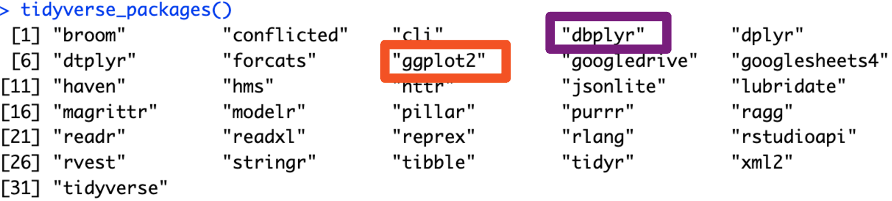

<!-- ::: {style="color: #8E44AD; text-align: center; margin-top: 20px;"}
**Last week:** Variables & Vectors | **This week:** Complex data structures! 🏗️
::: -->

# Welcome to Tidyverse! 🎉

::: {.callout-tip icon="true"}
## What You'll Learn Today

* 📦 **Installing & Loading** — Getting started with tidyverse and ggplot2
* 📊 **Built-in Datasets** — Working with `mpg` and `iris` data
* 👀 **Viewing Data** — Exploring your data effectively
<!-- * 🔧 **Data Manipulation** — Transforming data with dplyr -->
* 📈 **Visualization Basics** — Creating beautiful plots with ggplot2
* 📉 **Advanced Plotting** — Lines, smooths, trends, and customization
* 🎮 **Interactive Demos** — Hands-on practice with real data
:::

::: {style="color: #8E44AD; text-align: center; margin-top: 20px;"}
**Let's dive in and start exploring data!** 🚀
:::

---

# Part 1: Installation & Setup

::: {.callout-note icon="false"}
## Getting Your Environment Ready 🛠️
Installing and loading the essential packages. Note: We can skip this part since we have already been using `tidyverse` in our environment!
:::

---

## Installing Tidyverse

::: {.callout icon="false"}
**One Package, Many Superpowers!** ✨

The tidyverse is a collection of R packages designed to work together seamlessly.
:::

```r
# Install tidyverse (only need to do this once!)
# This installs: dplyr, ggplot2, tidyr, readr, purrr, tibble, 
#                stringr, forcats, and more!
install.packages("tidyverse")

# Check if installation was successful
library(tidyverse)

# You should see a message like:
# ── Attaching core tidyverse packages ── tidyverse 2.0.0 ──
# ✔ dplyr     1.1.4     ✔ readr     2.1.5
# ✔ forcats   1.0.0     ✔ stringr   1.5.1
# ✔ ggplot2   3.5.1     ✔ tibble    3.2.1
# ✔ lubridate 1.9.3     ✔ tidyr     1.3.1
# ✔ purrr     1.0.2
```

## Do It Yourself!

::: {.callout-tip}
**Pro Tip:** If you only need specific packages, you can install them individually:

```r
install.packages("ggplot2")  # Just for plotting
install.packages("dplyr")    # Just for data manipulation
```
:::

<center>
{width="80%"}
</center>

---

## Loading the Libraries

::: {.callout-blue icon="false"}
**Load Packages in Every Session** 🔄

You need to load packages each time you start R
:::

::: {.columns}
::: {.column}
**Method 1: Load Entire Tidyverse**

```r
# Load all tidyverse packages at once
library(tidyverse)

# This gives you access to:
# - ggplot2 for visualization
# - dplyr for data manipulation
# - tidyr for data tidying
# - readr for data import
# - purrr for functional programming
# - tibble for modern data frames
# - stringr for strings
# - forcats for factors
```
:::

::: {.column}
**Method 2: Load Individual Packages**

```r
# Load only what you need
library(ggplot2)  # For plotting
library(dplyr)    # For data wrangling

# Advantages:
# - Faster loading time
# - Clearer dependencies
# - Fewer potential conflicts

# Disadvantages:
# - More lines of code
# - Need to remember which 
#   package has which function
```
:::
:::

::: {.callout-note}
**For this work:** We'll use `library(tidyverse)` to load everything at once!
:::

---

## Verify Your Installation

<!-- ::: {.callout-tip icon="true"} -->
**Quick Check**: Make sure everything installs correctly! ✅
<!-- ::: -->

```r
# Load tidyverse
library(tidyverse)

# Check versions
packageVersion("ggplot2")
# [1] '3.5.1'

packageVersion("dplyr")
# [1] '1.1.4'

# List all loaded tidyverse packages
tidyverse_packages()
# [1] "broom"      "conflicted" "cli"        "dbplyr"     "dplyr"     
# [6] "dtplyr"     "forcats"    "ggplot2"    "googledrive"...

# Check for conflicts (functions with same names)
tidyverse_conflicts()
# ── Conflicts ────────────────────────────────────────── tidyverse_conflicts() ──
# ✖ dplyr::filter() masks stats::filter()
# ✖ dplyr::lag()    masks stats::lag()
```

<!-- ::: {.callout-warning}
**Conflicts are OK!** The tidyverse versions will be used by default. If you need the stats versions, use `stats::filter()` with the `::` notation.
::: -->


## Template Code for Your Own Projects?

::: {.callout-blue icon="true"}
Wait!! You can use the below code to start each project with RStudio with a clean environment.
:::

```r
# Function to clear environment, plots, and console
remove_existing_objects <- function() {
  rm(list = ls()) # Remove all objects from environment
  graphics.off() # Clear all plots
  cat("\014") # Clear console
}

# Load packages (install if not already installed)
required_packages <- c('tidyverse', 'dplyr')

# Function to install and load packages
install_and_load <- function(packages) {
  for(pkg in packages) {
    if(!require(pkg, character.only = TRUE, quietly = TRUE)) {
      install.packages(pkg)
      library(pkg, character.only = TRUE)
    }
  }
}

# Call the functions to set up the environment
install_and_load(required_packages)
remove_existing_objects()

######################

# Add your code below this line
```

---

# Part 2: Exploring Built-in Datasets

::: {.callout-note icon="false"}
## Practice with Real Data 📊
R comes with great datasets for learning. Some of these we have already seen in previous slides and work.
:::

---

## The MPG Dataset

::: {.callout-blue icon="false"}
**Fuel Economy Data** ⛽

EPA fuel economy data for 38 popular car models (1999-2008)
:::

::: {.columns}
::: {.column width="50%"}
**Loading and First Look**

```r
# Load tidyverse
library(tidyverse)

# The mpg dataset comes with ggplot2
data(mpg)

# Quick overview
mpg
# A tibble: 234 × 11
#   manufacturer model    displ  year   cyl trans 
#   <chr>        <chr>    <dbl> <int> <int> <chr> 
# 1 audi         a4         1.8  1999     4 auto…
# 2 audi         a4         1.8  1999     4 manua…
# 3 audi         a4         2    2008     4 manua…
# 4 audi         a4         2    2008     4 auto…
# ...

# Dimensions
dim(mpg)
# [1] 234  11

# 234 rows (cars), 11 columns (variables)
```
:::

::: {.column width="50%"}
**Variable Descriptions**

::: {callout}
* `manufacturer` - Car maker
* `model` - Model name
* `displ` - Engine displacement (liters)
* `year` - Manufacturing year
* `cyl` - Number of cylinders
* `trans` - Transmission type
* `drv` - Drive type (f/r/4)
* `cty` - City miles per gallon
* `hwy` - Highway miles per gallon
* `fl` - Fuel type
* `class` - Vehicle class
:::

:::

:::

---

## Viewing the MPG Data

::: {.callout-tip icon="true"}
## Multiple Ways to Explore 👀

Different functions show different aspects of your data
:::

```r
# View first 6 rows
head(mpg)

# View last 6 rows
tail(mpg)

# View first n rows
head(mpg, 10)

# Structure of the dataset
str(mpg)
# tibble [234 × 11] (S3: tbl_df/tbl/data.frame)
#  $ manufacturer: chr [1:234] "audi" "audi" "audi" "audi" ...
#  $ model       : chr [1:234] "a4" "a4" "a4" "a4" ...
#  $ displ       : num [1:234] 1.8 1.8 2 2 2.8 2.8 3.1 1.8 1.8 2 ...

# Summary statistics for all columns
summary(mpg)
#  manufacturer          model               displ            year     
#  Length:234         Length:234         Min.   :1.600   Min.   :1999  
#  Class :character   Class :character   1st Qu.:2.400   1st Qu.:1999  
#  Mode  :character   Mode  :character   Median :3.300   Median :2004  
#                                        Mean   :3.472   Mean   :2004  

# Get column names
names(mpg)
# [1] "manufacturer" "model"        "displ"        "year"         "cyl"         
# [6] "trans"        "drv"          "cty"          "hwy"          "fl"          
# [11] "class"

# View in RStudio viewer (interactive table)
View(mpg)
```

---

## The Iris Dataset

::: {.callout-blue icon="false"}
**Fisher's Classic Dataset** 🌸

Measurements of iris flowers - a classic for classification
:::

::: {.columns}
::: {.column}
**Loading and Exploring**

```r
# Load the iris dataset
data(iris)

# Convert to tibble (tidyverse format)
iris <- as_tibble(iris)

# View the data
iris
# A tibble: 150 × 5
#    Sepal.Length Sepal.Width Petal.Length
#           <dbl>       <dbl>        <dbl>
#  1          5.1         3.5          1.4
#  2          4.9         3            1.4
#  3          4.7         3.2          1.3
# ...

# Dimensions
dim(iris)
# [1] 150   5

# Column names
names(iris)
# [1] "Sepal.Length" "Sepal.Width"  "Petal.Length"
# [4] "Petal.Width"  "Species"
```
:::

::: {.column}
**Variable Descriptions**

* `Sepal.Length` - Sepal length (cm)
* `Sepal.Width` - Sepal width (cm)
* `Petal.Length` - Petal length (cm)
* `Petal.Width` - Petal width (cm)
* `Species` - Flower species
  - setosa
  - versicolor
  - virginica

**Perfect for:**
- Scatter plots
- Classification
- Comparing groups
- Visualizing relationships
:::
:::

---

## Comparing Datasets

::: {.callout-note icon="true"}
## Understanding Your Data 📋

Quick comparison of our two datasets: Each data set has its own structure, variables, and types, which we will explore in detail. We can use these structures to practice our data manipulation skills! Neat-O!
:::

::: {.columns}
::: {.column}
**MPG Dataset**

```r
glimpse(mpg)
# Rows: 234
# Columns: 11
# $ manufacturer <chr> "audi", "audi"...
# $ model        <chr> "a4", "a4"...
# $ displ        <dbl> 1.8, 1.8, 2.0...
# $ year         <int> 1999, 1999...
# $ cyl          <int> 4, 4, 4, 4...
# $ trans        <chr> "auto(l5)"...
# $ drv          <chr> "f", "f", "f"...
# $ cty          <int> 18, 21, 20...
# $ hwy          <int> 29, 29, 31...
# $ fl           <chr> "p", "p", "p"...
# $ class        <chr> "compact"...

# 234 observations
# Mixed data types
# Categorical + Numeric
```
:::

::: {.column}
**Iris Dataset**

```r
glimpse(iris)
# Rows: 150
# Columns: 5
# $ Sepal.Length <dbl> 5.1, 4.9, 4.7...
# $ Sepal.Width  <dbl> 3.5, 3.0, 3.2...
# $ Petal.Length <dbl> 1.4, 1.4, 1.3...
# $ Petal.Width  <dbl> 0.2, 0.2, 0.2...
# $ Species      <fct> setosa, setosa...

# 150 observations
# Mostly numeric
# One categorical variable
# Three balanced groups
```
:::
:::


---

# Part 3: Visualization with ggplot2

::: {.callout-note icon="false"}
## Creating Beautiful Plots 📈
The grammar of graphics
:::

---

## Every `ggplot()` Function
**The Three Essentials**

::: {.callout-note icon="false"}

1. **Data**: What to visualize
2. **Aesthetics** (`aes()`): Map variables to visual properties
3. **Geometries** (`geom_*()`): How to represent the data

:::

```r
ggplot(data = mpg, 
       aes(x = displ, y = hwy)) +
  geom_point()
```

```{r}
library(tidyverse)
ggplot(data = mpg, 
       aes(x = displ, y = hwy)) +
  geom_point()
```

---

## Build in Layers

```r
ggplot(mpg) +                    # 1. Data
  aes(x = displ, y = hwy) +      # 2. Aesthetics
  geom_point() +                 # 3. Geometry
  geom_smooth() +                # Add another layer
  labs(title = "Engine Size vs MPG")  # Labels
```


```{r}
library(tidyverse)
ggplot(mpg) +                    # 1. Data
  aes(x = displ, y = hwy) +      # 2. Aesthetics
  geom_point() +                 # 3. Geometry
  geom_smooth() +                # Add another layer
  labs(title = "Engine Size vs MPG")  # Labels
```

---

## Aesthetic Mappings

::: {.callout-note icon="false"}
Common aesthetics you can map:

* `x` - X-axis position
* `y` - Y-axis position
* `color` - Point/line color
* `fill` - Fill color (bars, areas)
* `size` - Point/line size
* `shape` - Point shape
* `alpha` - Transparency
* `linetype` - Line pattern

:::

## Aesthetic Mappings, For Example

```r
# Mapping vs Setting
ggplot(mpg, aes(x = displ, 
                y = hwy,
                color = class)) +  # Mapped
  geom_point(size = 3)  # Set (all points)

# Color maps from data
# Size is fixed at 3
```


```{r}
library(tidyverse)
# Mapping vs Setting
ggplot(mpg, aes(x = displ, 
                y = hwy,
                color = class)) +  # Mapped
  geom_point(size = 3)  # Set (all points)

# Color maps from data
# Size is fixed at 3
```

---


## Basic Scatter Plots with MPG

Exploring the relationship between engine size and fuel efficiency

```r
# Simple scatter plot
ggplot(mpg, aes(x = displ, y = hwy)) +
  geom_point()

# Add color by class
ggplot(mpg, aes(x = displ, y = hwy, color = class)) +
  geom_point()

# Customize point size and transparency
ggplot(mpg, aes(x = displ, y = hwy, color = class)) +
  geom_point(size = 3, alpha = 0.6)

# Add labels and title
ggplot(mpg, aes(x = displ, y = hwy, color = class)) +
  geom_point(size = 3, alpha = 0.6) +
  labs(
    title = "Fuel Efficiency vs Engine Size",
    subtitle = "Larger engines generally less efficient",
    x = "Engine Displacement (liters)",
    y = "Highway MPG",
    color = "Vehicle Class",
    caption = "Data: EPA fuel economy dataset"
  )

# Apply a theme
ggplot(mpg, aes(x = displ, y = hwy, color = class)) +
  geom_point(size = 3, alpha = 0.6) +
  labs(title = "Fuel Efficiency vs Engine Size",
       x = "Engine Displacement (liters)",
       y = "Highway MPG") +
  theme_minimal()
```


## Basic Scatter Plots with MPG, Output

::: {style="color: #8E44AD; text-align: center; margin-top: 20px;"}
The code for each plot is available on the previous slides.

:::

```{r}
# Simple scatter plot
ggplot(mpg, aes(x = displ, y = hwy)) +
  geom_point()

# Add color by class
ggplot(mpg, aes(x = displ, y = hwy, color = class)) +
  geom_point()

# Customize point size and transparency
ggplot(mpg, aes(x = displ, y = hwy, color = class)) +
  geom_point(size = 3, alpha = 0.6)

# Add labels and title
ggplot(mpg, aes(x = displ, y = hwy, color = class)) +
  geom_point(size = 3, alpha = 0.6) +
  labs(
    title = "Fuel Efficiency vs Engine Size",
    subtitle = "Larger engines generally less efficient",
    x = "Engine Displacement (liters)",
    y = "Highway MPG",
    color = "Vehicle Class",
    caption = "Data: EPA fuel economy dataset"
  )

# Apply a theme
ggplot(mpg, aes(x = displ, y = hwy, color = class)) +
  geom_point(size = 3, alpha = 0.6) +
  labs(title = "Fuel Efficiency vs Engine Size",
       x = "Engine Displacement (liters)",
       y = "Highway MPG") +
  theme_minimal()
```


---


## Adding (Smooth) Lines and Trends Part 1

```r
# Add smooth curve
ggplot(mpg, aes(x = displ, y = hwy)) +
  geom_point(alpha = 0.5) +
  geom_smooth()  # Default: LOESS

```

```{r}
# Add smooth curve
ggplot(mpg, aes(x = displ, y = hwy)) +
  geom_point(alpha = 0.5) +
  geom_smooth()  # Default: LOESS

```


## Adding (Smooth) Lines and Trends Part 2

```r
# Without confidence interval
ggplot(mpg, aes(x = displ, y = hwy)) +
  geom_point(alpha = 0.5) +
  geom_smooth(se = FALSE)
```

```{r}
# Without confidence interval
ggplot(mpg, aes(x = displ, y = hwy)) +
  geom_point(alpha = 0.5) +
  geom_smooth(se = FALSE)
```


## Adding (Smooth) Lines and Trends Part 3

```r
# Customize smooth appearance
ggplot(mpg, aes(x = displ, y = hwy)) +
  geom_point(alpha = 0.5) +
  geom_smooth(
    color = "red",
    linewidth = 1.5,
    se = TRUE,
    alpha = 0.2
  )
```

```{r}
# Customize smooth appearance
ggplot(mpg, aes(x = displ, y = hwy)) +
  geom_point(alpha = 0.5) +
  geom_smooth(
    color = "red",
    linewidth = 1.5,
    se = TRUE,
    alpha = 0.2
  )
```

---


## Linear Regression Lines Part 1

```r
# Add linear regression
library(ggpubr)
library(tidyverse)
ggplot(mpg, aes(x = displ, y = hwy)) +
  geom_point(alpha = 0.5) +
  geom_smooth(method = "lm")

```

```{r}
library(tidyverse)
if (!require('ggpubr')) {
  install.packages('ggpubr')
  library('ggpubr')
}
# Add linear regression
ggplot(mpg, aes(x = displ, y = hwy)) +
  geom_point(alpha = 0.5) +
  geom_smooth(method = "lm")
```


## Linear Regression Lines Part 2

```r

# Show formula and R²
ggplot(mpg, aes(x = displ, y = hwy)) +
  geom_point(alpha = 0.5) +
  geom_smooth(method = "lm", 
              formula = y ~ x) +
  stat_regline_equation(
    label.y = 45, 
    aes(label = ..eq.label..)
  )

```

```{r}
library(tidyverse)
library(ggpubr)

# Show formula and R²
ggplot(mpg, aes(x = displ, y = hwy)) +
  geom_point(alpha = 0.5) +
  geom_smooth(method = "lm", 
              formula = y ~ x) +
  stat_regline_equation(
    label.y = 45, 
    aes(label = ..eq.label..)
  )

```


## Linear Regression Lines Part 3

```r
# Add linear regression
library(ggpubr)
library(tidyverse)

# Linear model per group
ggplot(mpg, aes(x = displ, y = hwy,
                color = drv)) +
  geom_point() +
  geom_smooth(method = "lm", se = FALSE)
```

```{r}

# Linear model per group
ggplot(mpg, aes(x = displ, y = hwy,
                color = drv)) +
  geom_point() +
  geom_smooth(method = "lm", se = FALSE)
```

---

## Adding Lines and Trends: Smooth Line (LOESS) Part 1
*Locally Estimated Scatterplot Smoothing*

```r
# Add smooth curve
ggplot(mpg, aes(x = displ, y = hwy)) +
  geom_point(alpha = 0.5) +
  geom_smooth()  # Default: LOESS

```

```{r}
# Add smooth curve
ggplot(mpg, aes(x = displ, y = hwy)) +
  geom_point(alpha = 0.5) +
  geom_smooth()  # Default: LOESS

```

## Adding Lines and Trends: Smooth Line (LOESS) Part 2

```r
# Without confidence interval
ggplot(mpg, aes(x = displ, y = hwy)) +
  geom_point(alpha = 0.5) +
  geom_smooth(se = FALSE)
```

```{r}
# Without confidence interval
ggplot(mpg, aes(x = displ, y = hwy)) +
  geom_point(alpha = 0.5) +
  geom_smooth(se = FALSE)
```

## Adding Lines and Trends: Smooth Line (LOESS) Part 3

```r
# Customize smooth appearance
ggplot(mpg, aes(x = displ, y = hwy)) +
  geom_point(alpha = 0.5) +
  geom_smooth(
    color = "red",
    linewidth = 1.5,
    se = TRUE,
    alpha = 0.2
  )
```

```{r}
# Customize smooth appearance
ggplot(mpg, aes(x = displ, y = hwy)) +
  geom_point(alpha = 0.5) +
  geom_smooth(
    color = "red",
    linewidth = 1.5,
    se = TRUE,
    alpha = 0.2
  )
```


## Comprehensive Line Types Guide

Everything you need to know about lines

```r
# 1. Straight line through data points (ordered by x)
ggplot(mpg %>% filter(manufacturer == "audi"), 
       aes(x = year, y = hwy)) +
  geom_line(aes(group = model)) +
  geom_point()

# 2. Linear regression line (lm)
ggplot(mpg, aes(x = displ, y = hwy)) +
  geom_point() +
  geom_smooth(method = "lm",      # Linear model
              se = TRUE,           # Show confidence interval
              color = "blue",
              fill = "lightblue")

# 3. LOESS smooth (local regression - default)
ggplot(mpg, aes(x = displ, y = hwy)) +
  geom_point() +
  geom_smooth(method = "loess",   # Local regression
              span = 0.75,         # Smoothness (0.1-1)
              se = TRUE)

# 4. GAM (Generalized Additive Model)
ggplot(mpg, aes(x = displ, y = hwy)) +
  geom_point() +
  geom_smooth(method = "gam",     # More flexible curves
              formula = y ~ s(x, bs = "cs"))

# 5. Polynomial regression
ggplot(mpg, aes(x = displ, y = hwy)) +
  geom_point() +
  geom_smooth(method = "lm",
              formula = y ~ poly(x, 2))  # Quadratic

# 6. Reference lines (horizontal, vertical, diagonal)
ggplot(mpg, aes(x = cty, y = hwy)) +
  geom_point() +
  geom_abline(intercept = 0, slope = 1, # Diagonal: y = x
              linetype = "dashed", 
              color = "red") +
  geom_hline(yintercept = mean(mpg$hwy),  # Horizontal
             linetype = "dotted", 
             color = "blue") +
  geom_vline(xintercept = mean(mpg$cty),  # Vertical
             linetype = "dotdash", 
             color = "green")
```

## Comprehensive Line Types Guide, Output

Everything you need to know about lines

```{r}
# 1. Straight line through data points (ordered by x)
ggplot(mpg %>% filter(manufacturer == "audi"), 
       aes(x = year, y = hwy)) +
  geom_line(aes(group = model)) +
  geom_point()

# 2. Linear regression line (lm)
ggplot(mpg, aes(x = displ, y = hwy)) +
  geom_point() +
  geom_smooth(method = "lm",      # Linear model
              se = TRUE,           # Show confidence interval
              color = "blue",
              fill = "lightblue")

# 3. LOESS smooth (local regression - default)
ggplot(mpg, aes(x = displ, y = hwy)) +
  geom_point() +
  geom_smooth(method = "loess",   # Local regression
              span = 0.75,         # Smoothness (0.1-1)
              se = TRUE)

# 4. GAM (Generalized Additive Model)
ggplot(mpg, aes(x = displ, y = hwy)) +
  geom_point() +
  geom_smooth(method = "gam",     # More flexible curves
              formula = y ~ s(x, bs = "cs"))

# 5. Polynomial regression
ggplot(mpg, aes(x = displ, y = hwy)) +
  geom_point() +
  geom_smooth(method = "lm",
              formula = y ~ poly(x, 2))  # Quadratic

# 6. Reference lines (horizontal, vertical, diagonal)
ggplot(mpg, aes(x = cty, y = hwy)) +
  geom_point() +
  geom_abline(intercept = 0, slope = 1, # Diagonal: y = x
              linetype = "dashed", 
              color = "red") +
  geom_hline(yintercept = mean(mpg$hwy),  # Horizontal
             linetype = "dotted", 
             color = "blue") +
  geom_vline(xintercept = mean(mpg$cty),  # Vertical
             linetype = "dotdash", 
             color = "green")
```


---

## Customizing Line Appearance

```r
# Available linetypes
df <- data.frame(
  x = 1:10,
  y = rep(1:6, length.out = 10)
)

ggplot(mpg, aes(x = displ, y = hwy)) +
  geom_point(alpha = 0.3) +
  geom_smooth(
    method = "lm", 
    linetype = "solid"
  )

# Options for linetype:
# "solid" (or 1)
# "dashed" (or 2)
# "dotted" (or 3)
# "dotdash" (or 4)
# "longdash" (or 5)
# "twodash" (or 6)

# Example with multiple lines
ggplot(mpg, aes(x = displ, y = hwy, 
                color = drv)) +
  geom_point() +
  geom_smooth(method = "lm", 
              se = FALSE,
              aes(linetype = drv))
```

```{r}
# Available linetypes
df <- data.frame(
  x = 1:10,
  y = rep(1:6, length.out = 10)
)

ggplot(mpg, aes(x = displ, y = hwy)) +
  geom_point(alpha = 0.3) +
  geom_smooth(
    method = "lm", 
    linetype = "solid"
  )

# Options for linetype:
# "solid" (or 1)
# "dashed" (or 2)
# "dotted" (or 3)
# "dotdash" (or 4)
# "longdash" (or 5)
# "twodash" (or 6)

# Example with multiple lines
ggplot(mpg, aes(x = displ, y = hwy, 
                color = drv)) +
  geom_point() +
  geom_smooth(method = "lm", 
              se = FALSE,
              aes(linetype = drv))
```


## Line Customization

```r
# Control line appearance
ggplot(mpg, aes(x = displ, y = hwy)) +
  geom_point(alpha = 0.4) +
  geom_smooth(
    method = "lm",
    se = TRUE,
    color = "darkred",      # Line color
    fill = "pink",          # CI fill color
    linewidth = 1.5,        # Line width
    linetype = "dashed",    # Line type
    alpha = 0.3             # CI transparency
  )

# Multiple smooths with different methods
ggplot(mpg, aes(x = displ, y = hwy)) +
  geom_point(alpha = 0.4) +
  geom_smooth(
    method = "lm", 
    se = FALSE,
    color = "blue",
    aes(fill = "Linear")
  ) +
  geom_smooth(
    method = "loess",
    se = FALSE,
    color = "red",
    aes(fill = "LOESS")
  )
```


```{r}
# Control line appearance
ggplot(mpg, aes(x = displ, y = hwy)) +
  geom_point(alpha = 0.4) +
  geom_smooth(
    method = "lm",
    se = TRUE,
    color = "darkred",      # Line color
    fill = "pink",          # CI fill color
    linewidth = 1.5,        # Line width
    linetype = "dashed",    # Line type
    alpha = 0.3             # CI transparency
  )

# Multiple smooths with different methods
ggplot(mpg, aes(x = displ, y = hwy)) +
  geom_point(alpha = 0.4) +
  geom_smooth(
    method = "lm", 
    se = FALSE,
    color = "blue",
    aes(fill = "Linear")
  ) +
  geom_smooth(
    method = "loess",
    se = FALSE,
    color = "red",
    aes(fill = "LOESS")
  )
```

---

## Faceting: Multiple Plots

::: {.callout-note icon="true"}
## Split Your Plot by Groups 📊

Create separate panels for different categories
:::

```r
# Facet by one variable
ggplot(mpg, aes(x = displ, y = hwy)) +
  geom_point() +
  geom_smooth(method = "lm", se = FALSE) +
  facet_wrap(~ class)

# Facet by two variables (grid)
ggplot(mpg, aes(x = displ, y = hwy)) +
  geom_point() +
  facet_grid(drv ~ cyl)

# Free scales (each panel has own scale)
ggplot(mpg, aes(x = displ, y = hwy)) +
  geom_point() +
  geom_smooth(method = "lm", se = FALSE) +
  facet_wrap(~ class, scales = "free")

# Facet with different rows/columns
ggplot(mpg, aes(x = displ, y = hwy, color = drv)) +
  geom_point() +
  geom_smooth(method = "lm", se = FALSE) +
  facet_wrap(~ class, ncol = 3) +
  theme_minimal() +
  labs(
    title = "Fuel Efficiency by Vehicle Class",
    x = "Engine Displacement (L)",
    y = "Highway MPG",
    color = "Drive Type"
  )
```

```{r}
# Facet by one variable
ggplot(mpg, aes(x = displ, y = hwy)) +
  geom_point() +
  geom_smooth(method = "lm", se = FALSE) +
  facet_wrap(~ class)

# Facet by two variables (grid)
ggplot(mpg, aes(x = displ, y = hwy)) +
  geom_point() +
  facet_grid(drv ~ cyl)

# Free scales (each panel has own scale)
ggplot(mpg, aes(x = displ, y = hwy)) +
  geom_point() +
  geom_smooth(method = "lm", se = FALSE) +
  facet_wrap(~ class, scales = "free")

# Facet with different rows/columns
ggplot(mpg, aes(x = displ, y = hwy, color = drv)) +
  geom_point() +
  geom_smooth(method = "lm", se = FALSE) +
  facet_wrap(~ class, ncol = 3) +
  theme_minimal() +
  labs(
    title = "Fuel Efficiency by Vehicle Class",
    x = "Engine Displacement (L)",
    y = "Highway MPG",
    color = "Drive Type"
  )
```

---

## Visualizing the Iris Dataset


Multiple visualization approaches


```r
# Scatter Plot with Species
ggplot(iris, 
       aes(x = Petal.Length, 
           y = Petal.Width,
           color = Species)) +
  geom_point(size = 3, alpha = 0.7)

# Add smooth lines per species
ggplot(iris, 
       aes(x = Petal.Length, 
           y = Petal.Width,
           color = Species)) +
  geom_point(size = 2, alpha = 0.6) +
  geom_smooth(method = "lm", 
              se = TRUE) +
  theme_minimal() +
  labs(
    title = "Iris Petal Dimensions",
    x = "Petal Length (cm)",
    y = "Petal Width (cm)"
  )
```

```{r}
# Basic scatter
ggplot(iris, 
       aes(x = Petal.Length, 
           y = Petal.Width,
           color = Species)) +
  geom_point(size = 3, alpha = 0.7)

# Add smooth lines per species
ggplot(iris, 
       aes(x = Petal.Length, 
           y = Petal.Width,
           color = Species)) +
  geom_point(size = 2, alpha = 0.6) +
  geom_smooth(method = "lm", 
              se = TRUE) +
  theme_minimal() +
  labs(
    title = "Iris Petal Dimensions",
    x = "Petal Length (cm)",
    y = "Petal Width (cm)"
  )
```

---

## Multiple Dimensions

```r
# Sepal vs Petal lengths
ggplot(iris, 
       aes(x = Sepal.Length, 
           y = Petal.Length,
           color = Species,
           shape = Species)) +
  geom_point(size = 3, alpha = 0.7) +
  geom_smooth(method = "lm", 
              se = FALSE,
              linewidth = 1) +
  theme_bw()

# All pairwise comparisons
library(GGally)
iris %>%
  select(everything()) %>%
  ggpairs(aes(color = Species))
```

```{r}
# Sepal vs Petal lengths
ggplot(iris, 
       aes(x = Sepal.Length, 
           y = Petal.Length,
           color = Species,
           shape = Species)) +
  geom_point(size = 3, alpha = 0.7) +
  geom_smooth(method = "lm", 
              se = FALSE,
              linewidth = 1) +
  theme_bw()

# All pairwise comparisons
library(GGally)
iris %>%
  select(everything()) %>%
  ggpairs(aes(color = Species))
```

---

## More Plot Types

::: {.callout-tip icon="true"}
## Beyond Scatter Plots 📊

Common visualization types for different data
:::

```r
# Box plots - Distribution by group
ggplot(mpg, aes(x = class, y = hwy, fill = class)) +
  geom_boxplot() +
  theme_minimal() +
  theme(axis.text.x = element_text(angle = 45, hjust = 1)) +
  labs(title = "Highway MPG by Vehicle Class")

# Violin plots - Similar to boxplot but shows distribution shape
ggplot(mpg, aes(x = class, y = hwy, fill = class)) +
  geom_violin() +
  geom_jitter(width = 0.2, alpha = 0.3) +
  theme_minimal()

# Histogram - Distribution of a single variable
ggplot(mpg, aes(x = hwy)) +
  geom_histogram(bins = 30, fill = "steelblue", color = "black") +
  theme_minimal() +
  labs(title = "Distribution of Highway MPG")

# Density plot - Smooth version of histogram
ggplot(mpg, aes(x = hwy, fill = drv)) +
  geom_density(alpha = 0.5) +
  theme_minimal() +
  labs(title = "Highway MPG Distribution by Drive Type")

# Bar chart - Counts or values
ggplot(mpg, aes(x = class, fill = drv)) +
  geom_bar(position = "dodge") +
  theme_minimal() +
  theme(axis.text.x = element_text(angle = 45, hjust = 1))
```

```{r}
# Box plots - Distribution by group
ggplot(mpg, aes(x = class, y = hwy, fill = class)) +
  geom_boxplot() +
  theme_minimal() +
  theme(axis.text.x = element_text(angle = 45, hjust = 1)) +
  labs(title = "Highway MPG by Vehicle Class")

# Violin plots - Similar to boxplot but shows distribution shape
ggplot(mpg, aes(x = class, y = hwy, fill = class)) +
  geom_violin() +
  geom_jitter(width = 0.2, alpha = 0.3) +
  theme_minimal()

# Histogram - Distribution of a single variable
ggplot(mpg, aes(x = hwy)) +
  geom_histogram(bins = 30, fill = "steelblue", color = "black") +
  theme_minimal() +
  labs(title = "Distribution of Highway MPG")

# Density plot - Smooth version of histogram
ggplot(mpg, aes(x = hwy, fill = drv)) +
  geom_density(alpha = 0.5) +
  theme_minimal() +
  labs(title = "Highway MPG Distribution by Drive Type")

# Bar chart - Counts or values
ggplot(mpg, aes(x = class, fill = drv)) +
  geom_bar(position = "dodge") +
  theme_minimal() +
  theme(axis.text.x = element_text(angle = 45, hjust = 1))
```

---

# Part 4: Interactive Visualizations

---

## Code Generator Tool

::: {.callout-note icon="true"}
## Build Your Own Plot! 🛠️

Interactive tool to generate ggplot2 code
:::

```{=html}
<div id="code-generator" style="padding: 8px; border: 2px solid #27AE60; border-radius: 8px; background: #f8f9fa; font-size: 0.65em; max-width: 900px; margin: 0 auto;">
  <h3 style="text-align: center; font-size: 1.1em; margin: 3px 0;">ggplot2 Code Generator</h3>
  
  <div style="display: grid; grid-template-columns: 1fr 1fr 1fr; gap: 8px; margin: 5px 0;">
    <div>
      <label style="font-weight: bold; font-size: 0.85em;">Dataset:</label>
      <select id="gen-dataset" style="width: 100%; padding: 2px; margin: 2px 0; font-size: 0.9em;">
        <option value="mpg">mpg</option>
        <option value="iris">iris</option>
      </select>
      
      <label style="font-weight: bold; margin-top: 3px; display: block; font-size: 0.85em;">X Var:</label>
      <select id="gen-x" style="width: 100%; padding: 2px; margin: 2px 0; font-size: 0.9em;">
        <option value="displ">displ</option>
        <option value="hwy">hwy</option>
        <option value="cty">cty</option>
      </select>
      
      <label style="font-weight: bold; margin-top: 3px; display: block; font-size: 0.85em;">Y Var:</label>
      <select id="gen-y" style="width: 100%; padding: 2px; margin: 2px 0; font-size: 0.9em;">
        <option value="hwy" selected>hwy</option>
        <option value="cty">cty</option>
        <option value="displ">displ</option>
      </select>
    </div>
    
    <div>
      <label style="font-weight: bold; font-size: 0.85em;">Geom:</label>
      <select id="gen-geom" style="width: 100%; padding: 2px; margin: 2px 0; font-size: 0.9em;">
        <option value="point">point</option>
        <option value="line">line</option>
        <option value="smooth">smooth</option>
        <option value="point+smooth">point+smooth</option>
      </select>
      
      <label style="font-weight: bold; margin-top: 3px; display: block; font-size: 0.85em;">Color:</label>
      <select id="gen-color" style="width: 100%; padding: 2px; margin: 2px 0; font-size: 0.9em;">
        <option value="none">None</option>
        <option value="class">class</option>
        <option value="drv">drv</option>
      </select>
      
      <label style="font-weight: bold; margin-top: 3px; display: block; font-size: 0.85em;">Theme:</label>
      <select id="gen-theme" style="width: 100%; padding: 2px; margin: 2px 0; font-size: 0.9em;">
        <option value="minimal">minimal</option>
        <option value="bw">bw</option>
        <option value="classic">classic</option>
      </select>
    </div>
    
    <div style="display: flex; flex-direction: column; justify-content: space-around;">
      <label style="font-size: 0.9em;"><input type="checkbox" id="gen-lm"> Linear Model</label>
      <label style="font-size: 0.9em;"><input type="checkbox" id="gen-facet"> Facet by Class</label>
      <button id="generate-code" style="padding: 5px; background: #27AE60; color: white; border: none; border-radius: 4px; cursor: pointer; font-weight: bold; font-size: 0.9em;">
        Generate
      </button>
    </div>
  </div>
  
  <div style="background: #2c3e50; color: #ecf0f1; padding: 8px; border-radius: 4px; margin: 5px 0; font-family: 'Courier New', monospace; white-space: pre-wrap; font-size: 0.8em; max-height: 200px; overflow-y: auto; line-height: 1.2;">
<code id="generated-code">Click "Generate" to create ggplot2 code!</code>
  </div>
  
  <button id="copy-code" style="padding: 4px 12px; background: #3498db; color: white; border: none; border-radius: 4px; cursor: pointer; font-size: 0.85em;">
    📋 Copy
  </button>
</div>

<script>
function generatePlotCode() {
  const dataset = document.getElementById('gen-dataset').value;
  const xVar = document.getElementById('gen-x').value;
  const yVar = document.getElementById('gen-y').value;
  const colorVar = document.getElementById('gen-color').value;
  const geom = document.getElementById('gen-geom').value;
  const addLM = document.getElementById('gen-lm').checked;
  const facet = document.getElementById('gen-facet').checked;
  const theme = document.getElementById('gen-theme').value;
  
  let code = `library(ggplot2)\n\n`;
  code += `ggplot(${dataset}, aes(x = ${xVar}, y = ${yVar}`;
  
  if (colorVar !== 'none') {
    code += `, color = ${colorVar}`;
  }
  
  code += `)) +\n`;
  
  if (geom === 'point') {
    code += `  geom_point(size = 3, alpha = 0.7)`;
  } else if (geom === 'line') {
    code += `  geom_line(linewidth = 1)`;
  } else if (geom === 'smooth') {
    code += `  geom_smooth(method = "loess", se = TRUE)`;
  } else if (geom === 'point+smooth') {
    code += `  geom_point(size = 2, alpha = 0.6) +\n`;
    code += `  geom_smooth(method = "loess", se = TRUE)`;
  }
  
  if (addLM) {
    code += ` +\n  geom_smooth(method = "lm", se = FALSE, color = "red", linetype = "dashed")`;
  }
  
  if (facet) {
    code += ` +\n  facet_wrap(~ class)`;
  }
  
  code += ` +\n  theme_${theme}() +\n`;
  code += `  labs(\n`;
  code += `    title = "${dataset.toUpperCase()} Data Visualization",\n`;
  code += `    x = "${xVar}",\n`;
  code += `    y = "${yVar}"`;
  
  if (colorVar !== 'none') {
    code += `,\n    color = "${colorVar}"`;
  }
  
  code += `\n  )`;
  
  document.getElementById('generated-code').textContent = code;
}

document.getElementById('generate-code').addEventListener('click', generatePlotCode);

document.getElementById('copy-code').addEventListener('click', function() {
  const code = document.getElementById('generated-code').textContent;
  navigator.clipboard.writeText(code).then(() => {
    this.textContent = '✅ Copied!';
    setTimeout(() => {
      this.textContent = '📋 Copy to Clipboard';
    }, 2000);
  });
});

// Update options when dataset changes
document.getElementById('gen-dataset').addEventListener('change', function() {
  const xSelect = document.getElementById('gen-x');
  const ySelect = document.getElementById('gen-y');
  const colorSelect = document.getElementById('gen-color');
  
  if (this.value === 'iris') {
    xSelect.innerHTML = `
      <option value="Sepal.Length">Sepal.Length</option>
      <option value="Sepal.Width">Sepal.Width</option>
      <option value="Petal.Length" selected>Petal.Length</option>
      <option value="Petal.Width">Petal.Width</option>
    `;
    ySelect.innerHTML = `
      <option value="Sepal.Length">Sepal.Length</option>
      <option value="Sepal.Width">Sepal.Width</option>
      <option value="Petal.Length">Petal.Length</option>
      <option value="Petal.Width" selected>Petal.Width</option>
    `;
    colorSelect.innerHTML = `
      <option value="none">None</option>
      <option value="Species" selected>Species</option>
    `;
  } else {
    xSelect.innerHTML = `
      <option value="displ" selected>displ</option>
      <option value="hwy">hwy</option>
      <option value="cty">cty</option>
      <option value="cyl">cyl</option>
    `;
    ySelect.innerHTML = `
      <option value="hwy" selected>hwy</option>
      <option value="cty">cty</option>
      <option value="displ">displ</option>
      <option value="cyl">cyl</option>
    `;
    colorSelect.innerHTML = `
      <option value="none">None</option>
      <option value="class" selected>class</option>
      <option value="drv">drv</option>
      <option value="cyl">cyl</option>
    `;
  }
});
</script>
```

---

## 💪 Quick Challenge: Complete Workflow

::: {.callout-tip icon="true"}
## Your Turn! (5 minutes) ⏱️

Combine everything you've learned into one analysis:

**Task:** Analyze the `mpg` dataset to answer: "Which manufacturer makes the most fuel-efficient cars?"

1. Load tidyverse: `library(tidyverse)`
2. Calculate average highway MPG by manufacturer using `group_by()` and `summarize()`
3. Arrange results to find the top 5
4. Create a bar chart showing the top 5 manufacturers
5. Add appropriate labels and theme
6. **Bonus:** Create a scatter plot showing the relationship between engine size and fuel efficiency, colored by your top 5 manufacturers

**Hint:** You'll need: `filter()`, `group_by()`, `summarize()`, `arrange()`, `ggplot()`, `geom_col()` or `geom_point()`
:::

---

# Best Practices & Tips

::: {.callout-note icon="false"}
## Professional Workflow 🌟
Tips for effective data visualization
:::

---

## ggplot2 Best Practices

::: {.callout-important icon="false"}
**Make Your Plots Publication-Ready!** 📊

Professional visualization guidelines
:::

::: {.columns}
::: {.column}
**Do's**: Added details to plot

```r
# Clear, descriptive labels
ggplot(mpg, aes(x = displ, y = hwy)) +
  geom_point() +
  labs(
    title = "Fuel Efficiency vs Engine Size",
    subtitle = "EPA data 1999-2008",
    x = "Engine Displacement (liters)",
    y = "Highway MPG",
    caption = "Source: EPA"
  )

# Appropriate color scales
ggplot(iris, aes(x = Petal.Length,
                 y = Petal.Width,
                 color = Species)) +
  geom_point() +
  scale_color_brewer(palette = "Set1")

# Readable text
+ theme(
    text = element_text(size = 12),
    axis.text.x = element_text(angle = 45, hjust = 1)
  )

# Show data clearly
+ geom_point(alpha = 0.6, size = 2)
```
:::

::: {.column}
**Don'ts**: Common mistakes to avoid in plotting

```r
# Avoid: No labels
ggplot(mpg, aes(x = displ, y = hwy)) +
  geom_point()  # What does this show?

# Avoid: Too many colors
ggplot(mpg, aes(x = displ, y = hwy,
                color = model)) +
  geom_point()  # 38 colors = chaos

# Avoid: Unreadable text
+ theme(axis.text.x = element_text(
    angle = 90, 
    size = 6))  # Too small!

# Avoid: Overplotting
+ geom_point(size = 10, alpha = 1)
  # Can't see individual points

# Avoid: 3D pie charts!
# Never use 3D unless necessary
# Pie charts are hard to read
```
:::
:::

---

## Common ggplot2 Errors

::: {.callout-warning icon="false"}
**Troubleshooting Tips** 🔧

Common mistakes and how to fix them
:::

```r
# ERROR 1: Using + instead of %>%
mpg %>%
  filter(hwy > 30) +  # ❌ Wrong!
  ggplot(aes(x = displ, y = hwy)) +
  geom_point()

# FIX: Pipe to data, then + for ggplot layers
mpg %>%
  filter(hwy > 30) %>%  # ✅ Correct!
  ggplot(aes(x = displ, y = hwy)) +
  geom_point()

# ERROR 2: Aesthetics in wrong place
ggplot(mpg) +
  geom_point(aes(x = displ, y = hwy), color = class)  # ❌ Won't map

# FIX: Put mapped aesthetics inside aes()
ggplot(mpg, aes(x = displ, y = hwy, color = class)) +  # ✅
  geom_point()

# ERROR 3: Overwriting ggplot object
plot <- ggplot(mpg, aes(x = displ, y = hwy))
plot + geom_point()  # Shows
plot  # Still empty!

# FIX: Reassign or build completely
plot <- ggplot(mpg, aes(x = displ, y = hwy)) +
        geom_point()  # ✅

# ERROR 4: Forgetting to load libraries
ggplot(mpg, aes(x = displ, y = hwy)) +  # Error: could not find function "ggplot"

# FIX: Load tidyverse/ggplot2 first
library(tidyverse)  # ✅
```

---

## Saving Your Plots

::: {.callout-tip icon="true"}
## Export for Reports & Presentations 💾

Save plots in various formats
:::

```r
# Create your plot
my_plot <- ggplot(mpg, aes(x = displ, y = hwy, color = class)) +
  geom_point(size = 3, alpha = 0.7) +
  geom_smooth(method = "lm", se = FALSE) +
  theme_minimal() +
  labs(
    title = "Fuel Efficiency by Engine Size",
    x = "Engine Displacement (L)",
    y = "Highway MPG"
  )

# Save as PNG (for presentations, web)
ggsave("fuel_efficiency.png", 
       plot = my_plot,
       width = 10, 
       height = 6, 
       dpi = 300)

# Save as PDF (for publications)
ggsave("fuel_efficiency.pdf", 
       plot = my_plot,
       width = 10, 
       height = 6)

# Save as SVG (scalable, for editing)
ggsave("fuel_efficiency.svg", 
       plot = my_plot,
       width = 10, 
       height = 6)

# Quick save the last plot
ggsave("last_plot.png")  # Automatically uses last plot

# Adjust resolution for print
ggsave("high_res.png", 
       width = 10, 
       height = 6, 
       dpi = 600,  # High quality for print
       bg = "white")  # Ensure white background
```

---

# Summary & Resources

::: {.callout-note icon="false"}
## What You've Learned 🎉
Your journey with tidyverse and ggplot2
:::

---

## Key Takeaways Part 1

::: {.callout-important icon="false"}
**You're Now Ready to Explore Data!** 🚀

Core concepts mastered today
:::

::: {.callout-note icon="false"}
**✅ tidyverse Fundamentals:**

- Installing and loading packages
- The pipe operator `%>%` for readable code
- dplyr verbs: `filter()`, `select()`, `mutate()`, `summarize()`, `group_by()`, `arrange()`
- Working with real datasets (mpg, iris)
:::


## Key Takeaways Part 2

::: {.callout-note icon="false"}

**✅ ggplot2 Visualization:**

- Grammar of graphics: data + aesthetics + geometries
- Creating scatter plots, line plots, and more
- Adding trend lines: linear regression (`method = "lm"`) and smooths (`method = "loess"`)
- Customizing with themes, colors, and labels
- Faceting for multiple plots
- Line types and styles (solid, dashed, dotted, smooth)

**✅ Best Practices:**

- Clear labels and titles
- Appropriate color schemes
- Readable text and formatting
- Saving plots for different uses

:::

---

## Quick Reference

::: {.callout-note icon="false"}
**Cheat Sheet** 📋

Quick commands for reference
:::

```r
# Load packages
library(tidyverse)

# View data
head(mpg)
glimpse(iris)
summary(data)

# dplyr operations
data %>%
  filter(condition) %>%        # Keep rows
  select(col1, col2) %>%       # Choose columns
  mutate(new_col = calc) %>%   # Create columns
  group_by(category) %>%       # Group data
  summarize(mean = mean(x)) %>%  # Aggregate
  arrange(desc(col))           # Sort

# Basic ggplot
ggplot(data, aes(x = var1, y = var2)) +
  geom_point() +               # Scatter plot
  geom_smooth(method = "lm") + # Add trend line
  labs(title = "Title") +      # Labels
  theme_minimal()              # Theme

# Save plot
ggsave("plot.png", width = 10, height = 6, dpi = 300)
```
