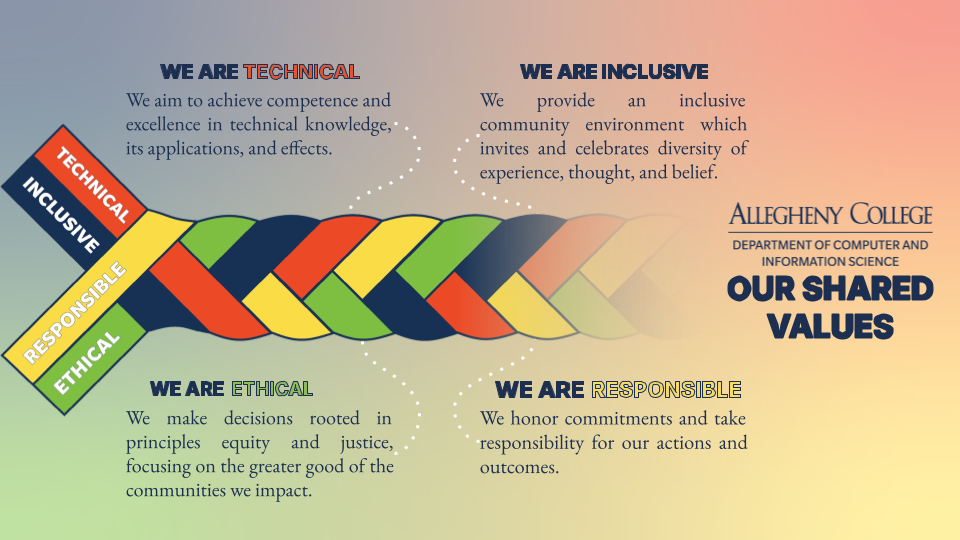

**CMPSC301 :: Data Science :: Fall 2026**

{width=20%}

**Instructor**: Dr. Bonham-Carter, [obonhamcarter@allegheny.edu](obonhamcarter@allegheny.edu)  
**Office Location**: Alden Hall 203

**Instructor Office Hours**: Visit the below URL to find availability and schedule and appointment.
[https://www.oliverbonhamcarter.com/contactandabout/](https://www.oliverbonhamcarter.com/contactandabout/)

**Book An Appointment**: [https://www.oliverbonhamcarter.com/contactandabout/](https://www.oliverbonhamcarter.com/contactandabout/)

*Note*: If the office hours times are not convenient, then please reach out to me and we can find an alternative time to meet.

### Meeting Times

<!-- add a line drop -->

&#x200B;

- **Lecture:** 
M/W/F 10:00 AM - 10:50 AM
25 August 2026 - 10 December 2026
  - **Location:** Alden Hall 101

- **Lab:** Friday, 2:30 PM - 4:00 PM
Th 2:30 PM - 4:00 PM
25 August 2026 - 10 December 2026
  - **Location:** Alden Hall 101

<!-- add a line drop -->

&#x200B;

### Quick Links

- [Token Form ](https://docs.google.com/forms/d/e/1FAIpQLSeBd0_nyJhIwlgQ4-doGfYIj_iTTMI47ffGefnYohwbEkA1lA/viewform?usp=publish-editor) for Automatic Extension

- The website for this class is located at;
<a href="https://dodatascience.com/" target="_blank">https://dodatascience.com/</a>

---

## Course Overview

Welcome to **CMPSC 301: Data Science**! This course provides a comprehensive introduction to the principles, techniques, and applications of data science. You'll learn how to collect, clean, analyze, visualize, and interpret data using modern computational tools and statistical methods.

## Course Description

CMPSC-301 Data Science (4 Credits)

A study of computational methods of data analysis with an emphasis on understanding and reflecting on the social, cultural, and political issues surrounding data and its interrogation. Participating in hands-on activities that often require teamwork, students study, design, and implement analytics software and learn how to build predictive models with foundational machine learning algorithms to extract knowledge from various sources of data. Students also investigate the biases, discriminatory views, and stereotypes that may be present during the collection and analysis of data, reflecting on the ethical implications of using the resulting machine learning techniques. During a weekly laboratory session, students use Industry-grade open source statistical software to complete projects, reporting on their findings through both written documents and oral presentations. Students are invited to use their own departmentally approved laptop in this course; a limited number of laptops are available for use during class and lab sessions.

**Prerequisites**
 - CMPSC101 or CMPSC102 - Must be completed prior to taking this course.

## Distribution Requirements

* **PD:** Power, Privilege, & Difference. Understanding Power, Privilege, & Difference means understanding the role of power, privilege, prejudice, discrimination, stereotypes, inequity, and oppression in human society, in both historical and contemporary contexts, and recognizing these dynamics in the learner’s own life and communities.

   * *Learning Outcome: Students who successfully complete this requirement will demonstrate an understanding of the historical and/or contemporary roles of power, privilege, and difference in human society.*

* **QR**: Quantitative Reasoning. Quantitative Reasoning is the ability to understand, investigate, communicate, and contextualize numerical, symbolic, and graphical information towards the exploration of natural, physical, behavioral, or social phenomena.

   * *Learning Outcome: Students who successfully complete this requirement will demonstrate an understanding of how to interpret numeric data and/or their graphical or symbolic representations.*

---

### Learning Objectives

By the end of this course, you will develop technical skills in programming in R and Python to be able to complete the following types of tasks:

- **Collect and clean** real-world data from various sources
- **Analyze data** using statistical methods and machine learning techniques
- **Visualize data** effectively to communicate insights
- **Build predictive models** using Python and R
- **Work with databases** and structured data formats
- **Apply data science** to solve real-world problems
- **Communicate findings** through reports and presentations

Data science skills developed:

* Gain a "big-picture" view of data science.
* Gain an understanding of the objectives and limitations of data analytics.
* Gain an understanding of the main methods in data science for analytical goals.
* Gain practical skills using relevant software tools and programming techniques.
* Gain an understanding of the contemporary roles of power and difference as they relate to the knowledge derived from a data set.
* Gain an understanding of biases, discrimination and stereotypes that maybe present during collection, analysis, and reflection on the latent trends in real-world data sets.

The course is divided into modules, with several of the modules consisting of investigations of real-world data in a specific field. In addition to learning specific technical and programming skills in each module students will be required to read a relevant article and prepare for a discussion related to the issues raised in the article.

Students will also enhance their ability to write and present ideas about data analytics in a clear and compelling fashion. Finally, students will gain practical experience in the design, implementation, and analysis of data for research during laboratory sessions and a final project.

## An Ethical Interest

Throughout the semester students will be challenged with serious analytical questions connecting the investigated data and its analysis to arising societal issues of bias, ethical consideration and the culture of power. This step is to ensure that analytics is performed with a lens on the data, as well as its impacts (positive and negative) on culture, community, and society. We note here that there is often no clear indication of a “correct” decision as a result of an analysis of data. The so-called “right” decision ought to be made by analysis who has studied both the data, and the consequences of decision in terms of humanitarian, environmental, ecological and other factors. This class cannot give you the correct decision, however it can help to enable your critical thinking skills which will provide you with some understanding of how to navigate to worthy decisions.

---

## Course Information

### 📚 Prerequisites

- CMPSC 101 (Data Structures) or equivalent programming experience
- Basic understanding of mathematics and statistics (or willingness to learn!)

___

## Course Structure

### Topics Covered

1. **Introduction to Data Science** - Tools, workflows, and ethical considerations
2. **Data Collection & Cleaning** - Web scraping, APIs, data wrangling
3. **Exploratory Data Analysis** - Statistical summaries and visualizations
4. **Data Visualization** - Creating effective plots and interactive dashboards
5. **Statistical Inference** - Hypothesis testing, confidence intervals
6. **Machine Learning Basics** - Supervised and unsupervised learning
7. **Predictive Modeling** - Regression, classification, model evaluation
8. **Time Series Analysis** - Working with temporal data
9. **Text Analysis & NLP** - Processing and analyzing text data
10. **Big Data & Databases** - SQL, NoSQL, and distributed computing
11. **Data Ethics & Privacy** - Responsible data science practices
12. **Final Project** - Apply data science to a real-world problem

### Tools & Technologies

We will be using the following technologies in class.

- **Languages:** Python, R
- **Libraries:** Pandas, NumPy, Matplotlib, Seaborn, Plotly, Scikit-learn, Tidyverse
- **Platforms:** Jupyter Notebooks, RStudio, GitHub
- **Data Tools:** SQL, APIs, web scraping tools
- Free GitHub Account
- Free Discord Account
- Allegheny College Email

Software References

- [VSCode](https://code.visualstudio.com/)
- [Rstudio](https://docs.posit.co/ide/user/#rstudio-ide-oss-downloads)
- [Python](https://www.python.org/downloads/) 3.12 or later
- [pipx](https://github.com/pypa/pipx)
- [UV](https://docs.astral.sh/uv/getting-started/installation/)
- [Gatorgrade](https://pypi.org/project/gatorgrade/)
- [Git](https://github.com/git-guides/install-git)

### Suggested Reading Material

The content from this course originates from the following textbooks and references.

- Wickham, Hadley, and Garrett Grolemund. R for Data Science: Import, Tidy, Transform, Visualize, and Model Data., O'Reilly Media, Inc., 2016.
  - [Book Website](https://r4ds.hadley.nz/)
- Wes McKinney, Python for Data Analysis
  - [Book Website](https://wesmckinney.com/book/)
- Julia Silge And David Robinson. Text Mining With R: A Tidy Approach., O'Reilly Media, Inc., 2019.
  - [Book Website](https://www.tidytextmining.com/)
- Elements of Data Science BY Allen B Downey
  - [Publisher Website](https://greenteapress.com/wp/elements-of-data-science/)
- Think Python, first edition, by Allen B. Downey.
  - [Publisher Website](https://greenteapress.com/wp/)
- _Circular Visualization in R_ by Zuguang Gu
  - [Book Website](https://jokergoo.github.io/circlize_book/book/introduction.html)
- Tuckfield, Bradford. Dive Into Data Science: Use Python to Tackle Your Toughest Business Challenges. No Starch Press, Incorporated, 2023.
- Vasiliev, Yuli. Python for Data Science: A Hands-on Introduction. No Starch Press, 2022.
- Zhang, Aston, et al. "Dive into deep learning." arXiv preprint arXiv:2106.11342 (2021).
  - [Book Website](https://d2l.ai/)
- [Introduction to Statistical Learning](https://www.statlearning.com/)

### Online Courses
- [Kaggle Learn](https://www.kaggle.com/learn)
- [Google's Machine Learning Crash Course](https://developers.google.com/machine-learning/crash-course)
- [Fast.ai](https://www.fast.ai/)

### Practice Platforms
- [Kaggle Competitions](https://www.kaggle.com/competitions)
- [DataCamp](https://www.datacamp.com/)
- [LeetCode](https://leetcode.com/) (for coding practice)

## Textbooks to help you write technical writing for Computer Science and STEM

- BUGS in Writing: A Guide to Debugging Your Prose (Second Edition). Lyn Dupr\'e. Addison-Wesley Professional. ISBN-10: 020137921X and ISBN-13: 978-0201379211, 704 pages, 1998. References to the textbook are abbreviated as "BIW".

- Writing for Computer Science (Second Edition). Justin Zobel. Springer ISBN-10: 1852338024 and ISBN-13:978-1852338022, 270 pages, 2004. References to the textbook are abbreviated as "WFCS".

### Grading

#### Grading Scale

Grades will be communicated by [Canvas](https://allegheny.instructure.com/)

<!-- =IF(DE6>94,"A",IF(DE6>90,"A-",IF(DE6>87,"B+",IF(DE6>83,"B",IF(DE6>80,"B-",IF(DE6>77,"C+",IF(DE6>73,"C",IF(DE6>70,"C-",IF(DE6>67,"D+",IF(DE6>60,"D","F")))))))))) -->

|Letter| Range |Letter |Range |Letter|Range|
|:------------|:-----------|:------------|:-----------|:------------|:-----------|
|A            | 96 - 100   |A-           | 90 - 95.9  |
|B+           | 87 - 89.9  |B            | 83 - 86.9  |B-           | 80 - 82.9  |
|C+           | 77 - 79.9  |C            | 73 - 76.9  |C-           | 70 - 72.9  |
|D+           | 67 - 69.9  |D            | 63 - 66.9  |F            | 59.9 and below  |

#### Benchmarks

The grade that a student receives in this class will be based on the following categories. All percentages are approximate and, if the need to do so presents itself, it is possible for the assigned percentages to change during the academic semester.

|Category              | Percentage | Assessment metric
|:-------------------- | :--------- | :-----------------
|In-Class Activities | 15%   | check mark grade
|Labs                | 40%   | letter grade
|Code Reviews        | 10%   | letter grade
|Midterm Exam        | 15%   | letter grade
|Final Project       | 20%   | letter grade
|Total               | 100%  |

#### Definitions of Grading Categories

- __In Class Activities__: These assignments invite students to explore different techniques for rigorously designing, implementing, programming, evaluating, and documenting real-world Python programs. These assignments will invite students to use tools like a text editor, a terminal window, and a modern Python development environment to implement functions that strike the right balance between understandability, generalizability, and specialization. Students will also use the data collected from running experiments to evaluate the implementation of a Python function as they consider, for instance, its efficiency and correctness. Knowledge gained from the class and the textbook will be integral to the completion of these projects. Unless other information is given about a due date, activities are to be completed by the end of class.

- __Labs__: Students meet once a week for two hours to complete practical work which will help them to gain some experience in programming, problem solving and group work. During some labs, students will gain experience in communication by presenting work, ideas and similar which is gained from work in class. Homework is generally due at the beginning of lab time.

- __Code Reviews__: During lab sessions, you will verbally explain your own code or a peer's code. In addition to describing what the code does and how it works, you will answer conceptual questions related to your code to demonstrate understanding of underlying programming concepts. This helps develop both communication skills and conceptual mastery.

- __Midterm Exam__: The exams will cover all of the material in their associated module(s). The finalized date for each of the exams will be announced at least one week in advance of the scheduled date. Unless prior arrangements are made with the course instructor, all students will be expected to take these exams on the scheduled date and complete the exams in the stated period of time.

- __Final Project__: This project will present you with an opportunity to design and implement a correct and carefully evaluated programming solution for a specific problem. Completion of the final project will require you to apply the knowledge, programming and technical skills that you have acquired during the course. The details for the final project will be given approximately a month before the project due date (during finals week).

---

### Final Deliverable

- Wednesday, 9th December 2026 at 9:00 AM
  [Complete Final Exam Schedule](https://sites.allegheny.edu/registrar/fall-2026-final-exam-schedule/)
- *Exam Code: G*
  
---

## Policies

</cneter>

This class is governed by the [Allegheny College Honor Code](https://www.allegheny.edu/academics/honor-code/) and the policies of the [Department of Computer and Information Science Policies](https://www.cis.allegheny.edu/teaching/policies/). All students are expected to adhere to these policies.

### _Assignment Submission_

All graded components of the course are expected to be turned in on time. Due dates are provided on each assignment. Electronic versions of the Engineering and Specification Labs must be submitted to through a student's GitHub repository created by GitHub Classroom. No credit will be awarded for any course work that you submit to the incorrect GitHub repository.

**Labs** are graded based on Gatorgrade scores and other criteria.

In each lab, there is a "Summary of Deliverables" to explains the distribution of points.

**Activities**
Nearly weekly, we will have an activity for which points in the course may be earned. Please be sure to turn in activities by the due date as they cannot be made up at a later time.

---

## Discord

The instructor will be using Discord to pass important information along to the class, such as code, news and other details. Please actively check your Discord each day to ensure that you are up-to-date with course events.

## Additional Policies

### Artificial Intelligence in Class

It is important for the students of the course to learn how to program. Generative AI may help to write code, but the programmer will not benefit in learning programming. Therefore, the use of artificial intelligence to generate code is not permitted unless otherwise stated in a particular assignment. Students will be asked to supply verbal explanations of assignments to supplement their code (by __Code Reviews__).

### _Attendance_

Students are expected to come to class **prepared, on time, and to stay engaged** for the duration of the class period. This includes both class and lab sessions. This behavior is core to our [shared departmental values](https://www.cis.allegheny.edu/teaching/policies/) and is in addition to the college’s attendance policy.

#### _Lateness_

One missed class or lab session counts as one absence. Coming to class/lab late, leaving early, or missing a large portion of a class/lab session will result in your being marked as “late” to class. Coming to class/lab unprepared may also result in being marked “late”. Being marked “late” to class three times during the course of a semester is equal to one absence.

Excluding the first week of the semester, students can have **eight** absences without any impact to their grade. These accommodations are meant to cover illness and emergency, so you should always come to class if you are able to do so.

As a general guideline, students cannot miss more than two weeks of class in total throughout the academic semester without receiving a letter grade reduction.

For this course, excluding the first week and eight excused absences, overall course grade will go down by 1/3 of a letter grade for each additional absence or absence equivalence regardless of base grade.

#### _Preparedness_

Coming to class prepared means coming with everything you need to engage in a class session. To satisfy basic expectations of CIS courses, this means, at minimum, that students must;

- Come to class with a department-approved laptop such as a Mac, Linux or Windows machine. There will be no time to diagnose and fix computer-related trouble during class-time. It will be assumed that the student is able to maintain their own machine on their own time.
- Arrive at class with a fully charged laptop, or with a laptop charger /batter pack to ensure that the laptop
  works throughout the entire class session.
- Complete any pre-session work such as readings and preparatory assignments.
- Complete homework on-time

#### _Engagement_

The term “engagement” or our expectation that students remain “engaged” can mean many things, often varying by course. Baseline behaviors that indicate engagement include:

- participation in class activities and discussions
- defined contribution to class sessions in full-class or group discussions
- note-taking (physical or digital)
- participating in course session attendance requirements
- not participating in non-course related activities
- not completing non-course related projects

### _Late Work Policy_

The deadlines for assignments are hard deadlines. This policy is intended to ensure that students keep up with course topics, are able to actively participate in class, and are accountable for managing time effectively.

All students in the CIS department are expected to turn in assignments on time. “On time” means on or before the assignment’s due date. This means that an assignment cannot be turned in for credit after a due date, unless the student applies a token.

#### _Tokens_

Students are allotted four (4) tokens to receive extensions on any assignment except the final with no questions asked by the course instructor except either in the rare cases of documented severe and/or extenuating circumstances or in cases that violate the CIS policy document or any College-approved policy.

* A token may be applied via a Google Form up to the assignment deadline, with exceptions granted only for severe and/or extenuating circumstances.

*  Tokens grant an automatic extension of **one week** to anything except the project or final exam.

* Tokens will not be accepted after the due date of the last lab. This means that token usage will end after the labs are complete and will no longer be accepted. This roughly implies that they will stop three or four weeks from the end of class.

[Token Form for Automatic Extension](https://docs.google.com/forms/d/e/1FAIpQLSeBd0_nyJhIwlgQ4-doGfYIj_iTTMI47ffGefnYohwbEkA1lA/viewform?usp=publish-editor)

### _Extenuating Circumstances_

Extenuating circumstances are exceptional, unforeseen, outside of your control, and
short-term, like illness and emergency. Regular circumstances associated with taking courses at Allegheny College are not considered extenuating.

The accommodations provided by tokens and permitted absences are meant to cover extenuating circumstances like illness, emergency, and work. However, if you have a contagious illness like COVID-19, the flu, or a cold, you should **not** come to class. If you have expended all your absences and tokens and are still sick with a contagious illness, you may contact your professor about options.  If your symptoms are mild or you are recovering from a respiratory illness, we recommend that you wear a mask to class.

Professor must be informed of all athletic obligations at the beginning of the semester, or with as much notice as possible. If you are feeling healthy and well, you should make every effort to come to class on time and to complete assignments, rather than using absences and tokens you may need later.

These no-questions-asked accommodations are meant to protect student privacy, and to remove the additional effort of acquiring documentation under duress of illness or emergency. In addition, they allow the professor to remain focused on teaching rather than adjudicating excuses.

If extenuating circumstances are severe enough to require more absences and tokens, you may contact your professor to discuss options. In most cases, however, a situation of this gravity warrants a request for a “Late Drop” or  “Incomplete” in the course, as the student will not have had adequate opportunity to learn the material.

---

## Communications

### _Using GitHub and Discord_

This course will primarily use GitHub and Discord for collaborative course communication. Communications that are not private matters must take place
in the Data Structures Channel in Discord.

The Allegheny College Computer and Information Science Discord
Server will also have useful announcements about departmental activities
including TL office hours.

### _Using Email_

Although we will primarily use Discord for class communication, the course
instructor will sometimes use email to send announcements about important
matters such as changes in the schedule. It is your responsibility to check your
email at least once a day and to ensure that you can reliably send and receive
emails.

---

## Honor Code

The Academic Honor Program that governs the entire academic program at
Allegheny College is described in the Allegheny Academic Bulletin. The Honor
Program applies to all work that is submitted for academic credit or to meet
non-credit requirements for graduation at Allegheny College. This includes all
work assigned for this class (e.g., examinations and course assignments). All
students who have enrolled in the College will work under the Honor Program.
Each student who has matriculated at the College has acknowledged the following
Honor Code pledge:

> I hereby recognize and pledge to fulfill my responsibilities, as
> defined in the Honor Code, and to maintain the integrity of both
> myself and the College community as a whole.

### _Effective Collaboration_

Computer science is an inherently collaborative discipline. The Department of
Computer and Information Science at Allegheny College
encourages students to engage in collaboration. However, in the context of
individual coursework, through which each student must demonstrate their own
knowledge, there are certain forms of collaboration that are and are not
acceptable.

- Acceptable forms of collaboration include:
    - Discussing high-level concepts.
    - Referring someone to a course text book, course slides, example programs,
      or other resources that contain helpful information or instructions.
    - Outlining the high-level steps to solving a problem, without mentioning specific
    - lines of code that need to be written.

- Unacceptable forms of collaboration include:
    - Sharing details about specific lines of code, including showing your
      source code to someone or looking at someone else's code.
    - Copying someone else's source code, technical writing, program commands,
      or program output, even with some slight modifications.
    - Typing source code, technical writing, or commands on someone else’s
      computer.

### _Plagiarism and Artificial Intelligence_

Students may not pass off or represent the work of another student, or their own prior work, as their own
current work in any case. Plagiarism and AI-generated code, text, or images are not permitted in any assignment
type unless the instructions supplied for the assignment explicitly state otherwise.For exams and all other
coursework, students are expected to adhere to the given instructions for the particular exam or item of
coursework. It is the responsibility of the student to review the authorization specifications on every item
and act appropriately, upholding the honor code. Suspected plagiarized or unauthorized use of AI to generate
the work that is turned in will be reported to the Honor Code Committee. This policy does not preclude the
use of AI to learn.

---

## Educational Accommodations

The Americans with Disabilities Act (ADA) is a federal anti-discrimination
statute that provides comprehensive civil rights protection for persons with
disabilities. Among other things, this legislation requires all students with
disabilities be guaranteed a learning environment that provides for reasonable
accommodation of their disabilities. Students with disabilities who believe they
may need accommodations in this class are encouraged to contact Student 
Accessibility and Support Services (SASS) at 814-332-2898. Student Accessibility 
and Support Services is part of the Learning Commons
and is located in Pelletier Library. Please do this as soon as possible to
ensure that approved accommodations are implemented in a timely fashion.

---

## Syllabus Changes

The instructor may make updates or changes to this document at any time as needed
until term grades are due. Changes will be announced to the class.

---

*This syllabus is subject to change. Updates will be announced in class and on the course website.*
